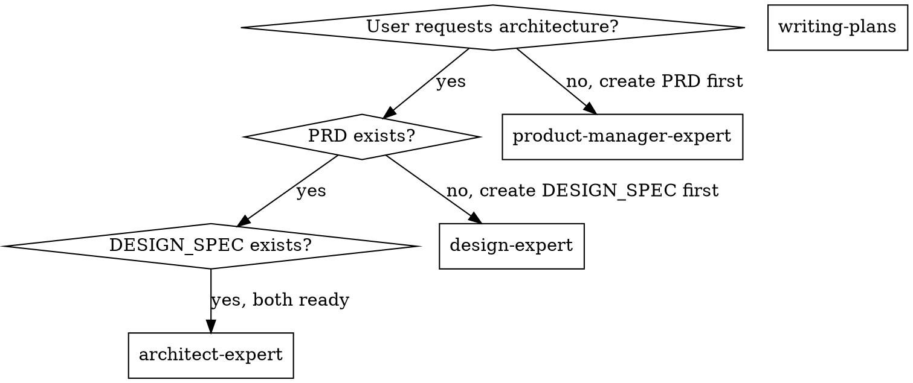

# Architect Expert

## Overview

Transform PRD and DESIGN_SPEC into executable system architecture: output detailed ARCHITECT document for each feature/page, define role-based task allocation and milestone recommendations.

## Essential Prerequisites

**Before starting, MUST confirm:** PRD and DESIGN_SPEC exist at `.claude/superpowers/plan/change/{feature}/`

**During execution, MUST use superpowers:brainstorming to explore all relevant points until requirements and design details are fully understood.** If brainstorming unavailable, use AskUserQuestion tool to continue probing.

**CRITICAL:** MUST identify key features and assign corresponding expert skills for collaboration (frontend/backend/multi-platform).

**Must continue questioning until requirements, scope, and constraints are clear.**

## Core Capabilities

- **Architecture abstraction** - Extract module boundaries, responsibilities, and collaboration from PRD/DESIGN_SPEC
- **System design** - Output layered architecture, key services/components, data flows, and integration points (detailed per feature/page)
- **Technology selection** - Provide executable tech stack and dependency list under constraints
- **Quality attributes** - Define performance, security, reliability, scalability, and operational requirements
- **Delivery allocation** - Form role-based task breakdown and dependency ordering, assign corresponding expert skills

## The Process

**Step 1: Requirement Input Validation**
- Get feature/module name (English directory name)
- Confirm PRD and DESIGN_SPEC paths and versions
- Define scope, goals, success metrics, constraints (time/resource/compliance/platform)
- Mark gaps as "Assumption + Validation Plan"

**Step 2: Per-Feature/Page Clarification**
- Cross-check PRD features against DESIGN_SPEC page inventory
- For each feature/page confirm: user roles, entry points, core flows, exception scenarios
- For each feature/page confirm: key data fields, permission boundaries, state changes

**Step 3: Key Feature Identification and Skill Assignment**
- Mark P0/P1 key features
- Assign expert skills to key features (frontend/backend/multi-platform)
- Specify what each skill produces for each feature

**Step 4: Architecture Decomposition and Boundary Definition**
- Abstract modules and subsystems from PRD feature tree
- Define module responsibilities, inputs/outputs, dependencies
- Identify cross-module shared data and core domain models

**Step 5: System Structure and Data Flow Design**
- Design layered architecture (client/service/data/infrastructure)
- Map key flows' data and state changes per feature/page
- Define interface types, sync/async mechanisms, and failure handling strategies

**Step 6: Technology Selection and Non-Functional Requirements**
- Provide tech stack and key dependencies (frontend/backend/data/infrastructure)
- Explain rationale and alternatives
- Define performance, stability, security, and observability metrics

**Step 7: Output ARCHITECT Document and Task Allocation**
- Output ARCHITECT document following fixed structure
- Divide role tasks (frontend/backend/data/infrastructure/testing)
- Mark expert skill assignments and deliverables for key features (frontend/backend/multi-platform)
- Mark key dependencies, risks, and milestones
- Save to `.claude/superpowers/plan/change/{feature}/ARCHITECT.md` (same directory as PRD, DESIGN_SPEC)

## Key Principles

- **Never assume interface behavior or business rules**—gaps must be questioned or marked as assumptions
- **Never provide "patch-only" solutions**—must provide global structure and boundaries
- **All modules must have clear responsibilities, inputs/outputs, dependencies, and error handling**
- **Any technology selection must explain rationale and risks**
- **ARCHITECT document must be executable, dividable, verifiable, and directly readable by developers**
- **Must detail architecture design and implementation points per feature/page**
- **Key features must explicitly specify corresponding expert skills and deliverables**

## Role and Skill Assignment (Priority Order)

**When assigning skills to roles, MUST follow this priority:**

### 1. Sub-agents First (Highest Priority)

**Search user-level agents first, then project-level agents:**

| Location | Path | Description |
|----------|------|-------------|
| User-level | `~/.claude/agents/*.md` | Personal sub-agents (override project) |
| Project-level | `{project}/agents/*.md` | Project sub-agents |

**Available sub-agents:**

| Role | Sub-agent | Location | Description |
|------|-----------|----------|-------------|
| **Code review** | `code-reviewer` | Project | Reviews code against plans and standards |

**To find sub-agents:**
```bash
# Step 1: Search user-level agents
Glob pattern: ~/.claude/agents/*.md

# Step 2: If no match, search project-level agents
Glob pattern: agents/*.md
```

### 2. Skills Second (Medium Priority)

**If no matching sub-agent exists, search user-level skills first, then project-level skills:**

| Location | Path | Description |
|----------|------|-------------|
| User-level | `~/.claude/skills/*/SKILL.md` | Personal skills (override project) |
| Project-level | `{project}/skills/*/SKILL.md` | Project skills |

**To find skills:**
```bash
# Step 1: Search user-level skills
Glob pattern: ~/.claude/skills/*{role}*/SKILL.md

# Step 2: If no match, search project-level skills
Glob pattern: skills/*{role}*/SKILL.md
```

### 3. Main Agent Fallback (Lowest Priority)

| Role | Expert Skill | Description |
|------|-------------|-------------|
| **Frontend development** | `frontend-developer-expert` | Web frontend pages, components, routing, state, interaction |
| **Multi-platform development** | `multi-platform-developer-expert` | iOS/Android cross-platform tasks |
| **Development coordination** | `development-lead-expert` | Dev lead, creates dev plans, schedules sub-skills, tracks progress |

**To find skills:**
```bash
# Use Glob tool to search skills/
Glob pattern: skills/*frontend*/SKILL.md
Glob pattern: skills/*backend*/SKILL.md
Glob pattern: skills/*server*/SKILL.md
Glob pattern: skills/*api*/SKILL.md
```

### 3. Main Agent Fallback (Lowest Priority)

If neither sub-agent nor skill exists, mark as "Use main agent"

**Example Assignment Process:**
```
Role: Backend development
→ Step 1: Search ~/.claude/agents/*backend*.md → No match
→ Step 2: Search agents/*backend*.md → No match
→ Step 3: Search ~/.claude/skills/*backend*.md → No match
→ Step 4: Search skills/*backend*.md, skills/*server*.md, skills/*api*.md → No match
→ Step 5: Mark as "Use main agent"
```

**Important:**
- **Never fabricate non-existent skill names**
- Skill list updates continuously—must re-search before each assignment
- When new expert skills are added, update this correspondence table
- **Priority: Sub-agents > Skills > Main agent**

## ARCHITECT Document Structure (12 Sections)

**Section 1: Architecture Overview** - Goals, scope, key constraints, success metrics

**Section 2: Architecture Principles & Quality Attributes** - Reliability, performance, security/compliance, scalability, observability

**Section 3: System Layers & Module Boundaries** - Layered architecture, module inventory and responsibilities, module dependencies

**Section 4: Core Data Model & Data Flows** - Key entities/domain models, key flow data flows (per feature/page), state change/consistency strategies

**Section 5: Interfaces & Integration** - Internal interfaces, external systems/third-party integration, sync/async mechanisms and failure retry

**Section 6: Feature/Page-Level Architecture Design (Per Item)**
> Map to PRD feature list and DESIGN_SPEC page list item by item

**Section 7: System Structure & Data Flow Design**

**Section 8: Technology Selection** - Frontend, backend, data/cache, infrastructure/deployment, rationale and alternatives

**Section 9: Non-Functional Requirements** - Performance metrics, security/permissions, availability/DR, monitoring/alerting

**Section 10: Risks & Trade-offs** - Risk inventory, impact assessment, mitigation strategies

**Section 11: Development Allocation & Milestones** - Role division and task list, skill assignment and deliverables (frontend/backend/multi-platform), key dependencies, milestones and deliverables

**Section 12: Assumptions & Validation Plan** - Assumption 1: ... → Validation method

## Supporting Documents

- **`./architect-template.md`** - Complete ARCHITECT markdown template with all sections

## Forbidden Behaviors

**NEVER:**
- Design architecture without PRD/DESIGN_SPEC as input
- Draw module diagrams without data flows and interfaces
- Choose technologies without rationale
- Assign tasks by role without specifying actual work
- Fabricate non-existent skill names
- Skip the sub-agent search priority
- Assign skills without verifying they exist

**INSTEAD:**
- Validate PRD/DESIGN_SPEC exist and are complete
- Include data flows and integration details
- Explain constraints, rationale, and alternatives
- Create executable task lists with dependencies
- Search agents/ and skills/ to verify existence
- Follow priority: sub-agents → skills → main agent
- Document search results when assigning

## Real Examples

**Bad: No Input Validation**
```
User: "Design architecture for payment system"
❌ "Here's the architecture: [proceeds to design]"
   (didn't check if PRD/DESIGN_SPEC exist)
```

**Good: Input Validation**
```
User: "Design architecture for payment system"
✅ "Let me verify inputs first.
   Feature name: payment-system
   Checking for PRD: .claude/superpowers/plan/change/payment-system/PRD.md
   Checking for DESIGN_SPEC: .claude/superpowers/plan/change/payment-system/DESIGN_SPEC.md
   Both exist. Proceeding with architecture design..."
```

**Bad: Wrong Priority**
```
Role: Frontend development
❌ "Assign skill: frontend-developer-expert"
   (didn't check if sub-agent exists first)
```

**Good: Correct Priority**
```
Role: Frontend development
✅ "Step 1: Search ~/.claude/agents/*frontend*.md → No match
   Step 2: Search agents/*frontend*.md → No match
   Step 3: Search ~/.claude/skills/*frontend*.md → No match
   Step 4: Search skills/*frontend*.md → Found: frontend-developer-expert
   Assignment: frontend-developer-expert skill (project-level)"
```

**Bad: Fabricated Skill**
```
Role: Database development
❌ "Assign skill: database-expert"
   (never verified if this skill exists)
```

**Good: Verified Search**
```
Role: Database development
✅ "Step 1: Search ~/.claude/agents/*database*.md → No match
   Step 2: Search agents/*database*.md → No match
   Step 3: Search ~/.claude/skills/*database*.md → No match
   Step 4: Search skills/*database*.md, skills/*db*.md → No match
   Step 5: Mark as 'Use main agent'"
```

## Handling Edge Cases

### When PRD or DESIGN_SPEC Missing

```
IF PRD or DESIGN_SPEC doesn't exist:
  1. STOP - don't proceed with architecture
  2. Notify user which document is missing
  3. Offer to create missing document first
  4. Document as blocker

Example:
"DESIGN_SPEC not found at .claude/superpowers/plan/change/payment-system/DESIGN_SPEC.md
Architecture requires both PRD and DESIGN_SPEC as inputs.
Should I create DESIGN_SPEC first using design-expert skill?"
```

### When PRD and DESIGN_SPEC Conflict

```
IF PRD and DESIGN_SPEC have conflicts:
  1. Surface specific conflicts
  2. Explain impact on architecture
  3. Ask which document takes precedence
  4. Document decision and rationale

Example:
"PRD specifies 'real-time notifications' but DESIGN_SPEC shows 'polling every 30s'.
These conflict for architecture approach.
Option A: Design for real-time (websockets), higher complexity
Option B: Design for polling, simpler but delayed
Which takes precedence?"
```

### When Technology Constraints Conflict

```
IF technology choices conflict (e.g., platform requirements vs. team skills):
  1. Surface the conflict explicitly
  2. Explain trade-offs
  3. Present options with implications
  4. Ask user to prioritize

Example:
"PRD requires 'iOS and Android' but team has 'React.js experience only'.
Options:
(a) Native iOS/Android = longer timeline, better performance
(b) React Native = leverages existing skills, acceptable performance
(c) Flutter = new skill for team, good performance
Which priority: timeline or performance?"
```

### When No Expert Skill Exists for Role

```
IF required role has no matching sub-agent or skill:
  1. Document the search attempts (all 4 levels)
  2. Mark as "Use main agent"
  3. Specify what main agent should produce
  4. Note for future skill/sub-agent creation

Example:
"Role: DevOps engineering
Step 1: Search ~/.claude/agents/*devops*.md → No match
Step 2: Search agents/*devops*.md → No match
Step 3: Search ~/.claude/skills/*devops*.md → No match
Step 4: Search skills/*devops*.md, skills/*infra*.md → No match
Assignment: Use main agent
Deliverable: Infrastructure as code, CI/CD pipeline, monitoring setup
Note: Consider creating devops sub-agent or devops-expert skill for future projects"
```

## Integration with Superpowers Workflow

### When to Use architect-expert



### Workflow Integration

**Phase 1: Requirements (product-manager-expert)**
- Generate comprehensive PRD
- Deliverable: Approved PRD

**Phase 2: Design (design-expert)**
- Generate DESIGN_SPEC with visual system
- Deliverable: Design specification

**Phase 3: Architecture (architect-expert)**
- Use PRD + DESIGN_SPEC as inputs
- Generate ARCHITECT with system design and skill assignments
- Deliverable: Architecture document

**Phase 4: Planning (writing-plans)**
- Use PRD + DESIGN_SPEC + ARCHITECT as inputs
- Break into implementation tasks
- Deliverable: Implementation plan

**Phase 5: Execution (subagent-driven-development OR executing-plans)**
- Execute plan, dispatch assigned expert skills per feature
- Deliverable: Working feature

## Collaboration with product-manager-expert and design-expert

**ARCHITECT → PRD Dependency:**
- ARCHITECT Section 4 (Data Model) references PRD Section 2 (User Analysis)
- ARCHITECT Section 6 (Feature Design) implements PRD Section 5 (Feature Design)
- ARCHITECT Section 8 (Tech Stack) must satisfy PRD Section 7 (Non-Functional Requirements)

**ARCHITECT → DESIGN_SPEC Dependency:**
- ARCHITECT Section 3 (Modules) must implement DESIGN_SPEC Section 4 (IA & Flows)
- ARCHITECT Section 6 (Feature Design) must align with DESIGN_SPEC Section 6 (Components)
- ARCHITECT technology choices must enable DESIGN_SPEC visual/interaction requirements

**Change Synchronization:**
```
WHEN PRD changes:
  1. Check if ARCHITECT exists
  2. Identify affected sections (modules, data, interfaces)
  3. Update ARCHITECT or mark for review

WHEN DESIGN_SPEC changes:
  1. Check if ARCHITECT exists
  2. Identify affected sections (components, integration)
  3. Update ARCHITECT or mark for review

WHEN ARCHITECT reveals PRD/DESIGN_SPEC gaps:
  1. Document missing requirements
  2. Propose updates to source documents
  3. Get user approval
  4. Update PRD/DESIGN_SPEC, then ARCHITECT
```

**Shared Folder Structure:**
```
.claude/superpowers/plan/change/{feature}/
├── PRD.md            # Requirements source of truth
├── DESIGN_SPEC.md    # Design implementation of PRD
├── ARCHITECT.md      # System architecture implementing both
└── CHANGELOG.md      # Optional: track changes across all
```

## Common Errors and Corrections

| Error | Correction |
|-------|------------|
| Architecture without PRD/DESIGN_SPEC | MUST validate inputs and scope first |
| Module diagrams without data flows | Include data flow and integration details |
| Technology choices without rationale | Explain constraints, rationale, alternatives |
| Role assignments without tasks | Create executable task lists with dependencies |
| Fabricated skill names | Search agents/ then skills/ to verify existence |

## Rationalization Counter-Arguments

| Rationalization | Reality |
|-----------------|---------|
| "Just give a rough architecture first" | Architecture must be executable. At minimum: modules, data flows, interfaces, allocation. |
| "Incomplete PRD is fine for design" | Gaps must be marked as assumptions with validation plans. |
| "Skip allocation for now" | Allocation is prerequisite for implementation. Must specify responsibilities and dependencies. |
| "I know the skills exist" | Skills change. Must search agents/ then skills/ before each assignment. |

## Red Flags (Stop and Return to Clarification)

- "Don't need PRD/DESIGN_SPEC, just give architecture"
- "No need for data flow and interface details"
- "Ignore risks and trade-offs for now"
- "Just give tech stack, don't need module breakdown"
- "I'll assign skills without searching"
- "Skip the sub-agent priority"
