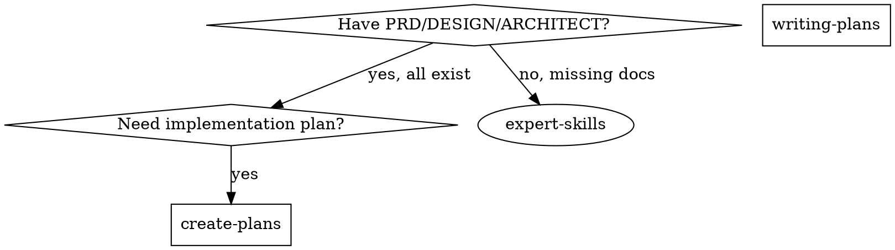

# Create Plans

## Overview

Generate TDD-integrated implementation plans from complete PRD + DESIGN_SPEC + ARCHITECT documents.

**Output:** Three-level plan (modules → features → 5-10 min TDD steps)

**Announce:** "I'm using the create-plans skill to generate the implementation plan."

**Save to:** `.agent/superpowers/plan/change/{feature}/IMPLEMENTATION_PLAN.md`

**Template & details:** See `implementation-plan-template.md` and `detailed-reference.md` in this directory.

**Language:** Reference docs are English (for AI), output plans are Chinese (for users).

## When to Use



**Use when:** All three documents exist (PRD, DESIGN_SPEC, ARCHITECT)

**Use writing-plans when:** Only have single spec/requirements

## Quick Reference

| Phase | Activity | Output |
|-------|----------|--------|
| **0. Assess** | Evaluate project scale | Single/Multi-file decision |
| **1. Validate** | Verify all 3 docs exist | Ready to proceed |
| **2. Extract** | Parse modules, dependencies, requirements | Module inventory |
| **3. Structure** | Three-level plan with TDD | IMPLEMENTATION_PLAN.md |
| **4. Identify** | Cross-reference gaps | Gap list |

## Plan Document Header

**Every plan MUST start with this header:**

```markdown
# [Feature Name] Implementation Plan

> **For Claude:** Use superpowers:executing-plans OR superpowers:subagent-driven-development
> **IMPORTANT:** Each step MUST follow TDD: RED (failing test) → GREEN (minimal code) → REFACTOR (improve) → COMMIT

**Goal:** [From PRD Section 1.2]
**Architecture:** [From ARCHITECT Section 1.1]
**Tech Stack:** [From ARCHITECT Section 8]
**Success Metrics:** [From PRD Section 1.2]

**Project Scale:**
- **Total Modules:** X
- **Estimated TDD Steps:** Y
- **Format:** Single file / Single file with phases / Multi-file

---
```

**Full template with examples:** See `implementation-plan-template.md` in this directory.

## The Process

### Step 0: Assess Project Scale

**Before generating plan, evaluate:**

1. Count modules from ARCHITECT Section 11
2. Estimate TDD steps (features × 3-5 steps each)
3. Apply thresholds to determine format

**Scale thresholds:**
- ≤5 modules AND ≤50 steps → Single file, no phases
- 6-10 modules OR 51-100 steps → Single file, with phases
- >10 modules OR >100 steps → Multi-file (overview + phase_N_name.md)

**Phase division:** Strictly follow ARCHITECT Section 11 module groups

See `detailed-reference.md` for complete phased planning guidance.

### Step 1: Validate Input Documents

**CRITICAL:** All three documents MUST exist before proceeding.

See `detailed-reference.md` for file structure and validation.

### Step 2: Extract and Cross-Reference

**PRD.md:** Success metrics, acceptance criteria, scope, NFRs

**DESIGN_SPEC.md:** Information architecture, visual tokens, components, interactions

**ARCHITECT.md:** Module decomposition, tech stack, data model, implementation roadmap

See `detailed-reference.md` for section-by-section extraction guide.

### Step 3: Generate Three-Level TDD-Integrated Plan

**Level 1 - Modules:** From ARCHITECT Section 11, follow roadmap order

**Level 2 - Features:** Implementable units with document references

**Level 3 - TDD Steps:** RED → GREEN → REFACTOR → COMMIT for each feature

**For large projects:** Group modules into phases following ARCHITECT Section 11

- Each phase gets checkpoint validation (tests, build, docs, dependencies)
- Multi-file format: `IMPLEMENTATION_PLAN.md` (overview) + `phase_N_name.md` (details)
- Single-file format: Phase sections with checkpoint dividers

See `implementation-plan-template.md` for structure, `detailed-reference.md` for TDD format and phased planning.

**Example: Three-Level Structure**

```markdown
## Module 1: User Authentication

**Source:** ARCHITECT Section 6.1, Section 11.4
**Dependencies:** None
**Phase:** Phase 1

### Module Overview

Implement user authentication with email/password login, session management, and password recovery (from ARCHITECT Section 6.1).

### Feature 1.1: Login Form Component

**User Story:** As a user, I want to log in with email/password (PRD Section 3.1.1)
**Acceptance Criteria:** Validates credentials, shows errors (PRD Section 8.1)

**Files:**
- Create: `src/components/auth/LoginForm.tsx` (from ARCHITECT Section 10.2)
- Test: `src/components/auth/__tests__/LoginForm.test.tsx`

**Design Requirements:**
- Component: DESIGN_SPEC Section 6.2.1 (Form component)
- States: default/error/loading/success (DESIGN_SPEC Section 6.2.1)
- Accessibility: ARIA labels, keyboard nav (DESIGN_SPEC Section 7.4)

**Implementation Notes:**
- Architecture: Use Context API for auth state (ARCHITECT Section 6.1.2)
- Data model: User session in localStorage (ARCHITECT Section 4.1)
- API endpoint: POST /api/auth/login (ARCHITECT Section 5.2)

#### Step 1: RED - Write failing test

**Test file:** `src/components/auth/__tests__/LoginForm.test.tsx`

```tsx
// Test for: Email validation
// References: PRD Section 3.1.1, DESIGN_SPEC Section 6.2.1

describe('LoginForm', () => {
  it('should show validation error for invalid email', async () => {
    render(<LoginForm />);
    const emailInput = screen.getByLabelText('Email');
    await userEvent.type(emailInput, 'invalid-email');
    await userEvent.click(screen.getByRole('button', { name: 'Login' }));
    expect(screen.getByText('Please enter a valid email')).toBeInTheDocument();
  });
});
```

**Run test and verify FAIL:**
```bash
npm test -- LoginForm.test.tsx
# Expected: FAIL with "LoginForm component not found"
```

#### Step 2: GREEN - Write minimal implementation

**Implementation file:** `src/components/auth/LoginForm.tsx`

```tsx
// Minimal implementation to pass test
// References: ARCHITECT Section 6.1.2

export function LoginForm() {
  const validateEmail = (email: string) => /^[^\s@]+@[^\s@]+\.[^\s@]+$/.test(email);
  const [email, setEmail] = React.useState('');
  const [error, setError] = React.useState('');

  const handleSubmit = (e: React.FormEvent) => {
    e.preventDefault();
    if (!validateEmail(email)) {
      setError('Please enter a valid email');
    }
  };

  return (
    <form onSubmit={handleSubmit}>
      <label>Email</label>
      <input
        type="email"
        value={email}
        onChange={(e) => setEmail(e.target.value)}
        aria-label="Email"
      />
      {error && <div role="alert">{error}</div>}
      <button type="submit">Login</button>
    </form>
  );
}
```

**Run test and verify PASS:**
```bash
npm test -- LoginForm.test.tsx
# Expected: PASS
```

#### Step 3: REFACTOR - Improve code

**Refactoring checklist:**
- [ ] Follows naming conventions (ARCHITECT Section 10.4)
- [ ] No code duplication (DRY)
- [ ] Single responsibility
- [ ] Clear, self-documenting code
- [ ] Proper error handling

**After refactoring, run test again:**
```bash
npm test -- LoginForm.test.tsx
# Expected: Still PASS
```

#### Step 4: Verify integration

```bash
npm test -- auth.integration.test.tsx
# Expected: PASS
```

#### Step 5: Manual verification (if UI component)

**Manual test steps:**
1. Open login page at /login
2. Enter "invalid-email" in email field
3. Click Login button
4. Verify error message appears

**Expected behavior:** Error message "Please enter a valid email" is displayed below email field (from PRD Section 8.1)

#### Step 6: Commit

```bash
git add src/components/auth/LoginForm.tsx src/components/auth/__tests__/LoginForm.test.tsx
git commit -m "feat(auth): add login form with email validation

- Implements LoginForm component with email validation
- Tests for email format validation
- References: PRD Section 3.1.1, DESIGN_SPEC Section 6.2.1, ARCHITECT Section 6.1.2
"

# Verify commit created
git log -1 --oneline
```

**Verification after commit:**
```bash
npm test      # All tests pass
npm run lint  # No linting errors
```

### Feature 1.2: Authentication Service
[Continue with next feature...]

---

## Module 2: User Profile Management
[Continue with next module...]
```

See `implementation-plan-template.md` for complete template with all phases.

### Step 4: Identify Gaps and Inconsistencies

Cross-reference all three documents for:
1. Missing information (features in PRD but not ARCHITECT)
2. Inconsistencies (PRD "must have" vs ARCHITECT "out of scope")
3. Assumptions needed (config values, error messages, deployment)

See `detailed-reference.md` for gap format.

## Key Principles

- **TDD mandatory:** Every feature needs RED-GREEN-REFACTOR (see `superpowers:test-driven-development`)
- **Precise references:** Cite specific sections (e.g., "PRD Section 3.1")
- **Verifiable steps:** Every test command has expected output
- **Follow ARCHITECT order:** Respect dependency order from Section 11
- **Identify gaps explicitly:** Don't assume - ask user
- **Output in Chinese:** Generated plans must be in Chinese for users

## Remember

- **Validate first:** Always verify PRD + DESIGN_SPEC + ARCHITECT exist before starting
- **Assess scale:** Evaluate project size to determine single/multi-file format
- **Follow ARCHITECT order:** Respect Section 11 module dependency order
- **TDD mandatory:** Every feature needs RED-GREEN-REFACTOR-COMMIT
- **Precise references:** Cite specific sections (e.g., "PRD Section 3.1.1")
- **Identify gaps:** Don't assume - list gaps for user confirmation
- **Phase check points:** Large projects MUST validate at each phase boundary
- **Language discipline:** Reference docs = English (for AI), Output plans = Chinese (for users)

## Common Mistakes

| Mistake | Fix |
|---------|-----|
| Skip document validation | MUST verify PRD, DESIGN_SPEC, ARCHITECT exist first |
| Skip scale assessment | Always evaluate project size before planning |
| Single-level task list | Use three-level: modules → features → TDD steps |
| Vague document references | Reference specific sections |
| Missing TDD steps | Each feature MUST have RED-GREEN-REFACTOR-COMMIT |
| No test commands | Include exact commands with expected outputs |
| Assume silently | Explicitly list gaps for user confirmation |
| Ignore ARCHITECT phases | Phase division MUST follow Section 11 module groups |
| Skip checkpoint validation | Each phase MUST verify tests, build, docs before proceeding |
| Output in wrong language | Reference docs = English, Output plans = Chinese |

## Red Flags - Stop and Re-read

- "Documents don't exist, I'll create them" ❌ → Must have all 3 documents (PRD, DESIGN_SPEC, ARCHITECT) first
- "ARCHITECT order is wrong, I'll reorder" ❌ → Follow Section 11 dependency order exactly
- "Skip TDD for simple features" ❌ → TDD is mandatory for ALL features, no exceptions
- "Test commands are obvious" ❌ → Must include exact commands with expected output
- "Gaps don't matter, I'll assume" ❌ → Must list gaps explicitly for user confirmation
- "Project is huge but single file is fine" ❌ → Use scale thresholds: ≤5, 6-10, >10 modules to decide format
- "I'll group modules differently than Section 11" ❌ → Phase division MUST follow Section 11 module groups
- "Checkpoint validation slows things down" ❌ → Phase checkpoints prevent cascade failures
- "Language doesn't matter" ❌ → Users need Chinese plans, AI needs English references

## Execution Handoff

**"Plan complete and saved to `.agent/superpowers/plan/change/{feature}/IMPLEMENTATION_PLAN.md`.**

**For single-file plans:**

**1. Subagent-Driven (this session)** → Use `superpowers:subagent-driven-development`

**2. Parallel Session (separate)** → Use `superpowers:executing-plans`

**For multi-file phased plans:**

Execute phases sequentially:
1. Complete Phase N → Verify checkpoint (tests pass, build succeeds, docs complete)
2. Move to Phase N+1 only after checkpoint validation
3. Use `superpowers:subagent-driven-development` within each phase

**Which approach?**

## Rationalization Counter-Arguments

| Rationalization | Reality |
|-----------------|---------|
| "TDD steps are too verbose" | Explicit TDD ensures discipline. |
| "Section references are overkill" | Specific references prevent ambiguity. |
| "Test commands are obvious" | Without exact commands, verification is skipped. |
| "Gaps can be resolved during implementation" | Unresolved gaps cause rework. |
| "Language doesn't matter" | Users need Chinese plans, AI needs English references. |
