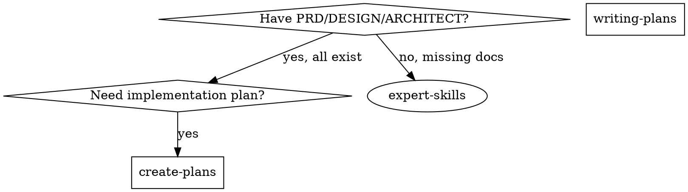

# Create Plans

## Overview

Generate TDD-integrated implementation plans from complete PRD + DESIGN_SPEC + ARCHITECT documents.

**Output:** Three-level plan (modules → features → 5-10 min TDD steps)

**Announce:** "I'm using the create-plans skill to generate the implementation plan."

**Save to:** `.claude/superpowers/plan/change/{feature}/IMPLEMENTATION_PLAN.md`

**Template & details:** See `implementation-plan-template.md` and `detailed-reference.md` in this directory.

**Language:** Reference docs are English (for AI), output plans are Chinese (for users).

## When to Use

**Use when:** All three documents exist (PRD, DESIGN_SPEC, ARCHITECT)

**Use writing-plans when:** Only have single spec/requirements

## Quick Reference

| Phase | Activity | Output |
|-------|----------|--------|
| **0. Assess** | Evaluate project scale | Single/Multi-file decision |
| **1. Validate** | Verify all 3 docs exist | Ready to proceed |
| **2. Extract** | Parse modules, dependencies, requirements | Module inventory |
| **3. Structure** | Three-level plan with TDD | IMPLEMENTATION_PLAN.md |
| **4. Identify** | Cross-reference gaps | Gap list |

## The Process

### Step 0: Assess Project Scale

**Before generating plan, evaluate:**

1. Count modules from ARCHITECT Section 11
2. Estimate TDD steps (features × 3-5 steps each)
3. Apply thresholds to determine format

**Scale thresholds:**
- ≤5 modules AND ≤50 steps → Single file, no phases
- 6-10 modules OR 51-100 steps → Single file, with phases
- >10 modules OR >100 steps → Multi-file (overview + phase_N_name.md)

**Phase division:** Strictly follow ARCHITECT Section 11 module groups

See `detailed-reference.md` for complete phased planning guidance.

### Step 1: Validate Input Documents

**CRITICAL:** All three documents MUST exist before proceeding.

See `detailed-reference.md` for file structure and validation.

### Step 2: Extract and Cross-Reference

**PRD.md:** Success metrics, acceptance criteria, scope, NFRs

**DESIGN_SPEC.md:** Information architecture, visual tokens, components, interactions

**ARCHITECT.md:** Module decomposition, tech stack, data model, implementation roadmap

See `detailed-reference.md` for section-by-section extraction guide.

### Step 3: Generate Three-Level TDD-Integrated Plan

**Level 1 - Modules:** From ARCHITECT Section 11, follow roadmap order

**Level 2 - Features:** Implementable units with document references

**Level 3 - TDD Steps:** RED → GREEN → REFACTOR → COMMIT for each feature

**For large projects:** Group modules into phases following ARCHITECT Section 11

- Each phase gets checkpoint validation (tests, build, docs, dependencies)
- Multi-file format: `IMPLEMENTATION_PLAN.md` (overview) + `phase_N_name.md` (details)
- Single-file format: Phase sections with checkpoint dividers

See `implementation-plan-template.md` for structure, `detailed-reference.md` for TDD format and phased planning.

### Step 4: Identify Gaps and Inconsistencies

Cross-reference all three documents for:
1. Missing information (features in PRD but not ARCHITECT)
2. Inconsistencies (PRD "must have" vs ARCHITECT "out of scope")
3. Assumptions needed (config values, error messages, deployment)

See `detailed-reference.md` for gap format.

## Key Principles

- **TDD mandatory:** Every feature needs RED-GREEN-REFACTOR (see `superpowers:test-driven-development`)
- **Precise references:** Cite specific sections (e.g., "PRD Section 3.1")
- **Verifiable steps:** Every test command has expected output
- **Follow ARCHITECT order:** Respect dependency order from Section 11
- **Identify gaps explicitly:** Don't assume - ask user
- **Output in Chinese:** Generated plans must be in Chinese for users

## Common Mistakes

| Mistake | Fix |
|---------|-----|
| Skip document validation | MUST verify PRD, DESIGN_SPEC, ARCHITECT exist first |
| Skip scale assessment | Always evaluate project size before planning |
| Single-level task list | Use three-level: modules → features → TDD steps |
| Vague document references | Reference specific sections |
| Missing TDD steps | Each feature MUST have RED-GREEN-REFACTOR-COMMIT |
| No test commands | Include exact commands with expected outputs |
| Assume silently | Explicitly list gaps for user confirmation |
| Ignore ARCHITECT phases | Phase division MUST follow Section 11 module groups |
| Skip checkpoint validation | Each phase MUST verify tests, build, docs before proceeding |
| Output in wrong language | Reference docs = English, Output plans = Chinese |

## Red Flags - Stop and Re-read

- "Documents don't exist, I'll create them"
- "ARCHITECT order is wrong, I'll reorder"
- "Skip TDD for simple features"
- "Test commands are obvious"
- "Gaps don't matter, I'll assume"
- "Project is huge but single file is fine"
- "I'll group modules differently than Section 11"
- "Checkpoint validation slows things down"

## Execution Handoff

**"Plan complete and saved to `.claude/superpowers/plan/change/{feature}/IMPLEMENTATION_PLAN.md`.**

**For single-file plans:**

**1. Subagent-Driven (this session)** → Use `superpowers:subagent-driven-development`

**2. Parallel Session (separate)** → Use `superpowers:executing-plans`

**For multi-file phased plans:**

Execute phases sequentially:
1. Complete Phase N → Verify checkpoint (tests pass, build succeeds, docs complete)
2. Move to Phase N+1 only after checkpoint validation
3. Use `superpowers:subagent-driven-development` within each phase

**Which approach?**

## Rationalization Counter-Arguments

| Rationalization | Reality |
|-----------------|---------|
| "TDD steps are too verbose" | Explicit TDD ensures discipline. |
| "Section references are overkill" | Specific references prevent ambiguity. |
| "Test commands are obvious" | Without exact commands, verification is skipped. |
| "Gaps can be resolved during implementation" | Unresolved gaps cause rework. |
| "Language doesn't matter" | Users need Chinese plans, AI needs English references. |
