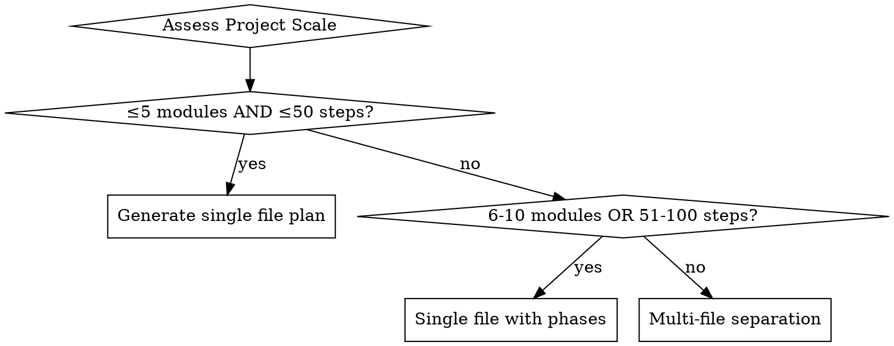

# Create Plans - Detailed Reference

> This file contains detailed reference material for the create-plans skill.
> See SKILL.md for the main reference.
>
> **IMPORTANT:** This reference is in English (for Claude to read).
> Generated OUTPUT plans should be in Chinese (for users to read).

## Document Structure Validation

### Required Files

All three documents MUST exist before proceeding:

```
.agent/superpowers/plan/change/{feature}/
├── PRD.md            # Required - Product Requirements Document
├── DESIGN_SPEC.md    # Required - Design Specification
└── ARCHITECT.md      # Required - Architecture Document
```

### Validation Steps

1. Determine feature name (from user input or directory structure)
2. Use Bash to verify all files exist
3. If any missing: **STOP and report error**

```bash
# Example validation command
test -f .agent/superpowers/plan/change/{feature}/PRD.md && \
test -f .agent/superpowers/plan/change/{feature}/DESIGN_SPEC.md && \
test -f .agent/superpowers/plan/change/{feature}/ARCHITECT.md && \
echo "All documents exist" || echo "Missing documents"
```

## Document Content Extraction

### From PRD.md
- **Section 1 (Overview):** Feature summary, success metrics
- **Section 3 (Scope):** In-scope/out-of-scope features
- **Section 4 (Flows):** User flows and interaction patterns
- **Section 5 (NFR):** Non-functional requirements (performance, security)

### From DESIGN_SPEC.md
- **Section 4 (Information Architecture):** Content structure, navigation
- **Section 5 (Visual Design):** Tokens, colors, typography
- **Section 6 (Components):** Component specifications
- **Section 7 (Interactions):** Micro-interactions, animations

### From ARCHITECT.md
- **Section 3 (Views):** Architectural views (logical, deployment, etc.)
- **Section 6 (Features):** Feature breakdown with dependencies
- **Section 10 (Dev Guide):** Development guidelines
- **Section 11 (Roadmap):** Implementation order with dependencies

## TDD Integration Details

### RED Phase: Write Failing Test

For each feature step:

```markdown
**RED: Write failing test**
- Test file: [path to test file]
- Command: ```[exact test command]```
- Expected output: [exact failure message]
```

### GREEN Phase: Write Minimal Code

```markdown
**GREEN: Write minimal implementation**
- Implementation file: [path to implementation]
- Command: ```[run same test]```
- Expected output: [exact success message]
```

### REFACTOR Phase: Improve Code

```markdown
**REFACTOR: Improve while green**
- Refactoring action: [specific improvement]
- Command: ```[run same test]```
- Expected output: [still passing]
```

### COMMIT Phase: Save Work

```markdown
**COMMIT: Save working state**
- Commit message: [descriptive message]
- Co-Authored-By: Claude <noreply@anthropic.com>
```

## Gaps and Inconsistencies Format

When cross-referencing documents, format findings as:

```markdown
## Gaps and Assumptions

### Requires User Confirmation:
1. [Gap description] - Options: A / B - Recommended: A

### Assumptions Made:
1. [Assumption] - Validation: [method to verify]

### Inconsistencies Found:
1. [Description] - Resolution: [approach]
```

## Common Gap Examples

### Missing Information
- PRD mentions feature X, but ARCHITECT doesn't include it
- DESIGN_SPEC specifies component but ARCHITECT has no module

### Inconsistencies
- PRD says "must have" but ARCHITECT marks "out of scope"
- Different technology choices between documents

### Assumptions Needed
- Configuration values (timeouts, limits)
- Error message wording
- Deployment environment details

## Section Reference Examples

Always cite specific sections with document name:

| Instead of | Use |
|------------|-----|
| "from PRD" | "PRD Section 3.1" |
| "design says" | "DESIGN_SPEC Section 5.2" |
| "architecture" | "ARCHITECT Section 11.3" |

## Output Path Reference

**Always save plans to:**
```
.agent/superpowers/plan/change/{feature}/IMPLEMENTATION_PLAN.md
```

**Template location:**
```
skills/create-plans/implementation-plan-template.md
```

## Implementation Roadmap Order

Follow ARCHITECT Section 11 order exactly:

1. Foundation modules (no dependencies)
2. Core business logic (depends on foundation)
3. Integration layers (depends on core)
4. UI/UX components (depends on integration)
5. Testing and validation (cross-cutting)

**Critical:** Do not reorder modules. Dependency order exists for technical reasons.

---

## Phased Planning for Large Projects

### Project Scale Assessment

Before generating the plan, assess project scale:

```yaml
Assessment:
  - Count modules from ARCHITECT Section 11
  - Estimate TDD steps per module (features × 3-5 steps)
  - Check dependency complexity

Output:
  - Total module count
  - Estimated TDD step count
  - Recommended format (single/phased/multi-file)
```

### Scale Thresholds

```yaml
thresholds:
  small_single_file:
    condition: "≤5 modules AND ≤50 steps"
    output: "IMPLEMENTATION_PLAN.md (no phases)"

  medium_phased:
    condition: "6-10 modules OR 51-100 steps"
    output: "IMPLEMENTATION_PLAN.md (with phases)"

  large_multi_file:
    condition: ">10 modules OR >100 steps"
    output: "IMPLEMENTATION_PLAN.md (overview) + phase_N_name.md (details)"
```

### Phase Division Rules

**Strictly follow ARCHITECT Section 11:**

```markdown
Phase Division Rules:
  - Each module group from Section 11 becomes a phase
  - Maintain dependency order (Phase N depends on Phase N-1)
  - Phase names reflect core functionality of that group

Example:
  Phase 1: Foundation (Infrastructure Layer - Modules A, B)
  Phase 2: Core Logic (Core Business Logic - Modules C, D, E)
  Phase 3: Integration (Integration Layer - Modules F, G)
  Phase 4: UI Components (Interface Components - Modules H, I)
```

### File Organization

#### Single File with Phases (Medium Projects)

```markdown
.agent/superpowers/plan/change/{feature}/
└── IMPLEMENTATION_PLAN.md

# {Feature} Implementation Plan

## Phase 1: {Phase Name} (Modules: X, Y, Z)

### Module X
[...TDD steps...]

### Module Y
[...TDD steps...]

---

## Phase 1 Checkpoint
- [ ] All tests in phase pass
- [ ] Build succeeds
- [ ] Documentation updated
- [ ] Next phase dependencies satisfied

## Phase 2: {Phase Name}
[...]
```

#### Multi-File Organization (Large Projects)

```
.agent/superpowers/plan/change/{feature}/
├── IMPLEMENTATION_PLAN.md          # Overview (2-3 pages)
├── phase_1_foundation.md
├── phase_2_core_logic.md
├── phase_3_integration.md
└── phase_4_ui_components.md
```

**IMPLEMENTATION_PLAN.md (Overview) Content:**
```markdown
# {Feature} Implementation Plan - Overview

## Project Scale
- Total Modules: X
- Estimated TDD Steps: Y
- Phases: Z

## Phase 1: Foundation (Modules: A, B)
**Estimated Steps:** 15
**Dependencies:** None

### Module A
- Feature 1: [title]
- Feature 2: [title]
- Feature 3: [title]

### Module B
- Feature 1: [title]

## Phase 2: Core Logic (Modules: C, D, E)
**Estimated Steps:** 35
**Dependencies:** Phase 1 complete
[...]

## Execution Order
1. Complete Phase 1 → Verify checkpoint
2. Complete Phase 2 → Verify checkpoint
3. Complete Phase 3 → Verify checkpoint
4. Complete Phase 4 → Final verification
```

**phase_N_name.md (Detail) Content:**
```markdown
# Phase N: {Phase Name}

## Overview
**Modules in this phase:** X, Y, Z
**Estimated duration:** [time]
**Dependencies:** Phase N-1 complete

## Module X
### Feature 1: {Feature Name}
**References:** PRD Section X.Y, ARCHITECT Section Z.W

**RED:** Write failing test
[...TDD details...]
```

### Phase Checkpoint Validation

**Automatic verification at each phase boundary:**

```yaml
Checkpoint Validation:
  Tests:
    - Run all tests in phase
    - Verify: All tests pass

  Build:
    - Run build command
    - Verify: Build succeeds, no errors

  Documentation:
    - Check phase documentation completeness
    - Verify: All sections have content

  Dependencies:
    - Verify next phase prerequisites
    - Verify: Dependent modules are implemented

Format:
  ## Phase N Checkpoint
  - [ ] All tests pass (command: `npm test`)
  - [ ] Build succeeds (command: `npm run build`)
  - [ ] Documentation updated
  - [ ] Next phase dependencies satisfied
```

### File Naming Conventions

**Multi-file phase naming:** `phase_{N}_{name}.md`

Examples:
- `phase_1_foundation.md`
- `phase_2_core_logic.md`
- `phase_3_integration.md`

### Archive Strategy for Completed Plans

**When all phases complete:**

```bash
# Move all plan files to archive
mv IMPLEMENTATION_PLAN.md .agent/superpowers/plan/archive/{feature}_IMPLEMENTATION_PLAN.archive.md
mv phase_*.md .agent/superpowers/plan/archive/
```

**Archive structure:**
```
.agent/superpowers/plan/archive/
├── {feature}_IMPLEMENTATION_PLAN.archive.md
├── phase_1_foundation.md
├── phase_2_core_logic.md
└── phase_3_integration.md
```

### Decision Flow: Single vs Multi-File


