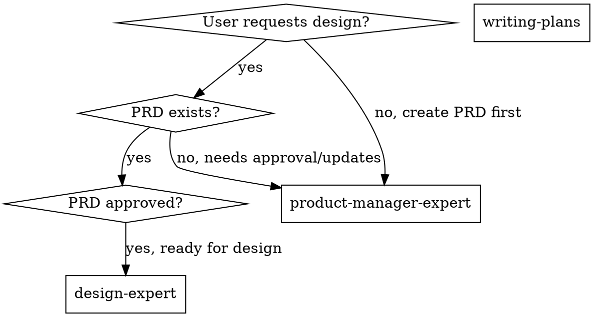

# Design Expert

## Overview

Generate executable design specifications based on PRD and design preferences: conduct design research and UX analysis first, then output streamlined visual system and interaction guidelines, forming actionable design spec.

## Essential Prerequisites

**Before starting, MUST confirm:** Target platform (Web/Mobile/Desktop) and design preferences (style/brand/competitor references).

**During execution, MUST use superpowers:brainstorming to explore all relevant points until requirements are fully understood.** If brainstorming unavailable, use AskUserQuestion tool to continue probing.

**CRITICAL: Design research MUST use ui-ux-pro-max skill.** The ui-ux-pro-max skill is a specialized design research subagent that:
- Conducts comprehensive design trend research
- Analyzes competitor design patterns
- Returns structured research findings for design-expert to use
- See "ui-ux-pro-max Integration" section for detailed invocation protocol

**CRITICAL: PRD must exist before starting design work.** Use superpowers:product-manager-expert first if PRD doesn't exist.

## Core Capabilities

- **Requirement interpretation** - Extract goals, users, core scenarios, and success metrics from PRD
- **User experience analysis** - Build user journeys and key touchpoints, identify experience pain points
- **Design research** - MUST use MCP search tools to gather industry and competitor design trends
- **Design system & tokens** - Establish reusable design tokens, component specifications, and version conventions
- **Accessibility** - Follow WCAG accessibility principles for contrast, usability, and inclusivity
- **Visual system** - Establish unified specifications for color/typography/grid/icons/components
- **Interaction guidelines** - Define key flows, states, and feedback rules to avoid ambiguity
- **Collaboration delivery** - Deliver executable specs and component inventory for developers

## ui-ux-pro-max Integration

### Overview

The `ui-ux-pro-max` skill is a specialized design research subagent. It MUST be invoked during Step 2 (Design Trend Research) to gather comprehensive design trends and competitor analysis.

### When to Invoke ui-ux-pro-max

```
design-expert (Step 2: Design Trend Research)
       ↓
    [Invoke ui-ux-pro-max skill]
       ↓
ui-ux-pro-max conducts research
       ↓
    [Returns structured findings]
       ↓
design-expert synthesizes findings into DESIGN_SPEC
```

### Invocation Protocol

**Step 1: Prepare Research Brief**
Before invoking ui-ux-pro-max, prepare the following information:
- Feature/product name
- Target platform (Web/Mobile/Desktop)
- Design preferences (style, brand tone, competitor references)
- Key user scenarios from PRD
- Specific research questions (e.g., "What are current dashboard design trends?")

**Step 2: Invoke ui-ux-pro-max Skill**

Use the Skill tool to invoke ui-ux-pro-max:

```
Skill(skill="ui-ux-pro-max")
```

Then provide the research brief:

```
Please conduct design research for:

**Product/Feature:** {feature name}
**Platform:** {Web/Mobile/Desktop}
**Design Preferences:** {style/brand/competitors}
**Key Scenarios:** {from PRD}

Research focus:
1. Industry design trends for this type of product
2. Competitor design analysis (visual style, layout patterns, interactions)
3. Borrowable design patterns and anti-patterns
4. Recommendations for visual system direction

Return structured findings I can use in DESIGN_SPEC.
```

**Step 3: Receive Research Findings**

ui-ux-pro-max will return structured findings including:
- Industry trends (with data/support)
- Competitor analysis (visual style, layout, interactions)
- Design patterns worth borrowing
- Recommended design direction
- Potential pitfalls to avoid

**Step 4: Synthesize into DESIGN_SPEC**

Use ui-ux-pro-max findings to populate DESIGN_SPEC Section 3 (Design Research):
- Cite specific trends and patterns
- Reference competitor examples
- Justify design direction with research data
- Document borrowable elements

### Expected Output from ui-ux-pro-max

```markdown
## Design Research Findings

### Industry Trends
- Trend 1: [Description] + [Support/Data]
- Trend 2: [Description] + [Support/Data]

### Competitor Analysis
| Competitor | Visual Style | Layout Patterns | Interactions | Borrow | Avoid |
|------------|--------------|-----------------|--------------|--------|-------|
| [Name]     | [Description] | [Patterns]     | [Description]| [What] | [What] |

### Design Direction Recommendations
Based on research, recommended direction:
- [Direction 1 with rationale]
- [Direction 2 with rationale]
- [Direction 3 with rationale]

### Key Design Patterns to Borrow
- Pattern 1: [Description] → [Usage context]
- Pattern 2: [Description] → [Usage context]
```

### Fallback if ui-ux-pro-max Unavailable

If ui-ux-pro-max skill is not available:
1. **MUST use available web search tools** to conduct design research
2. Conduct comprehensive research on trends, competitors, and patterns
3. Document findings in structured format
4. Note in DESIGN_SPEC: "Research conducted via web search (ui-ux-pro-max unavailable)"

## The Process

**Step 1: Requirement Analysis**
- Parse PRD for goals, users, scenarios, scope, and constraints
- Define design objectives and success metrics
- Document required business and compliance requirements
- Verify PRD exists and is approved

**Step 2: Design Trend Research**
- **CRITICAL: MUST invoke ui-ux-pro-max skill** for comprehensive design research
- See "ui-ux-pro-max Integration" section for detailed invocation protocol
- Prepare research brief with feature name, platform, design preferences, and key scenarios
- Invoke ui-ux-pro-max using Skill tool with research brief
- Receive structured research findings (trends, competitors, patterns, recommendations)
- Synthesize findings into DESIGN_SPEC Section 3 (Design Research)
- **Fallback only if ui-ux-pro-max unavailable:** Use any available web search tools to conduct research

**Step 3: Experience Strategy & Visual System**
- Define information architecture and key user flows
- Establish visual system (color/typography/spacing/grid/icons)
- Specify component and state specifications (default/hover/disabled/error)
- Establish design tokens and accessibility rules (contrast/font size/focus)

**Step 4: Generate Design Spec Document**
- Output DESIGN_SPEC ensuring executability and feasibility
- Mark assumptions and items pending validation
- Deliverable must include: visual system, interaction guidelines, component inventory, accessibility requirements
- Save to `.claude/superpowers/plan/change/{feature}/DESIGN_SPEC.md` (use English for {feature} folder name)
- DESIGN_SPEC and PRD must coexist in same feature folder; subsequent changes must sync

## Key Principles

- **Confirm feature/module name, target platform, and design preferences first**
- **Support design directions with research data**, avoid arbitrary decisions
- **Design system and tokens drive consistency and reusability**
- **Specify interaction and accessibility rules clearly** for developer implementation
- **PRD is source of truth for requirements**, DESIGN_SPEC implements those requirements visually

## Design Spec Structure (8 Sections)

**Section 1: Project Overview** - Feature name, target platform, design goals, design preferences/brand tone

**Section 2: Users & Scenarios** - Core user personas, key scenarios and tasks, experience pain points and opportunities (references PRD Section 2)

**Section 3: Design Research** - Industry trends, competitor references, conclusions and design direction

**Section 4: Information Architecture & Flows** - Information architecture, key user flows, key page inventory (references PRD Section 5)

**Section 5: Visual System** - Color system, typography system, grid/spacing, icons/illustrations, design tokens (naming and hierarchy)

**Section 6: Component Specifications** - Base components (consider architecture), business components (consider architecture), state specifications, component library integration (if any)

**Section 7: Interaction Specifications** - Feedback and motion, error and empty states, usability principles, accessibility and inclusivity

**Section 8: Assumptions Pending Validation** - Assumption 1: ... → Validation method

## Supporting Documents

- **`./design-spec-template.md`** - Complete DESIGN_SPEC markdown template with all sections

## Forbidden Behaviors

**NEVER:**
- Skip design research because "I know design trends"
- Create visual specs without referencing PRD requirements
- Design features that aren't in PRD scope
- Write vague interaction specs like "should feel smooth"
- Skip accessibility requirements
- Accept "whatever" or "make it look good" without clarification
- Design components without defining all states
- Ignore technical constraints from PRD

**INSTEAD:**
- **MUST invoke ui-ux-pro-max skill** for design research in Step 2
- Follow ui-ux-pro-max Integration protocol for research brief preparation
- Use ui-ux-pro-max structured findings to populate DESIGN_SPEC Section 3
- Reference PRD sections explicitly in DESIGN_SPEC
- Surface scope creep: "This feature isn't in PRD, add it?"
- Write specific interaction rules with timing/state
- Include WCAG contrast ratios, keyboard navigation
- Present 2-3 design direction options based on research
- Define default/hover/disabled/error/focus for all components
- Check PRD Section 7 for non-functional requirements

## Real Examples

**Bad: No Research**
```
User: "Design a dashboard"
❌ "I'll create a modern dashboard with cards and charts."
   (no research, just opinion)
```

**Good: Using ui-ux-pro-max for Research**
```
User: "Design a dashboard"
✅ "Let me conduct comprehensive design research using ui-ux-pro-max..."

[Invokes ui-ux-pro-max skill]

Research brief:
**Product/Feature:** Analytics Dashboard
**Platform:** Web (desktop-first)
**Design Preferences:** Clean, data-focused, similar to Linear/Notion
**Key Scenarios:** Data visualization, report generation, real-time monitoring

[Receives structured findings from ui-ux-pro-max]

Research findings:
- Industry trends: Card-based layouts (80% adoption), dark mode support (70%),
  collapsible sidebars (65%), data tables with inline actions (60%)
- Competitor analysis:
  * Linear: Minimalist, monochromatic with accent colors, excellent typography hierarchy
  * Mixpanel: Heavy use of cards, clear data visualization patterns
  * Tableau: Complex dashboards with customizable widgets
- Recommended direction: Clean card layout with collapsible sidebar,
  monochromatic base with strategic accent colors for CTAs
- Key patterns to borrow: Tab-based navigation, drill-down interactions,
  export actions in context menus

"Based on research, I recommend a clean card-based layout with collapsible
sidebar. This aligns with 80% of current dashboards. Does this direction work?"
```

**Fallback: Web Search (if ui-ux-pro-max unavailable)**
```
User: "Design a dashboard"
✅ "Let me research current dashboard design trends using web search..."
   [Uses available web search tools]
   "Research shows: card-based layouts (80%), sidebar navigation (70%),
   data tables with inline actions (60%). Proposed direction: clean
   card layout with collapsible sidebar. Does this align?"
```

**Bad: Vague Specs**
```
❌ "Buttons should be nice and have good hover effects"
```

**Good: Specific Specs**
```
✅ "Primary button: 16px height, brand color background, 1px border
   Hover: 10% darker brand color, 0.98 scale, 150ms ease
   Disabled: 40% opacity, no-interactive cursor
   Focus: 2px blue outline, 3px offset"
```

**Bad: Ignoring PRD**
```
PRD: "Supports light mode only"
❌ DESIGN_SPEC: "Dark mode colors: ..."
   (designing outside scope)
```

**Good: Scope Check**
```
PRD: "Supports light mode only"
✅ "PRD specifies light mode only. Should I add dark mode support
   to DESIGN_SPEC or defer to future scope?"
```

**Bad: Missing States**
```
❌ "Button component: blue background, white text"
   (what about hover, disabled, error, loading?)
```

**Good: Complete States**
```
✅ "Button has 5 states:
   - Default: blue background
   - Hover: darker blue, scale(0.98)
   - Active: darkest blue
   - Disabled: gray, 40% opacity
   - Loading: spinner, blue background"
```

## Handling Edge Cases

### When Design Preferences Conflict with PRD

```
IF design preferences conflict with PRD requirements:
  1. Surface the conflict explicitly
  2. Explain impact on user experience
  3. Present options with trade-offs
  4. Ask user to decide

Example:
"PRD requires 'fast loading' but you prefer 'high-res imagery'.
These conflict: high-res images slow page load.
Options: (a) Use lower-res images, (b) Implement lazy loading,
(c) Accept slower page load. Which priority?"
```

### When PRD Is Insufficient for Design

```
IF PRD missing critical design information:
  1. Document what's missing
  2. Ask user for clarification
  3. Offer to research if appropriate
  4. Document as assumption if user approves

Example:
"PRD doesn't specify mobile breakpoint behavior.
Should I design for desktop-first or mobile-first?
Or research responsive best practices for this type of app?"
```

### When Technical Constraints Limit Design

```
IF PRD non-functional requirements constrain design:
  1. Reference specific PRD constraint
  2. Explain design limitation
  3. Propose alternatives within constraints
  4. Ask for direction

Example:
"PRD Section 7 requires 'P95 load time < 1.5s'.
Proposed animation (300ms fade) pushes us to 1.7s.
Options: (a) Reduce to 150ms, (b) Remove animation,
(c) Relax performance requirement. Preference?"
```

### When DESIGN_SPEC Reveals PRD Gaps

```
IF design process reveals missing PRD requirements:
  1. Document the gap
  2. Explain why it matters for implementation
  3. Propose PRD addition
  4. Get user approval before updating PRD

Example:
"During component design, discovered PRD doesn't specify
error handling behavior. Added to DESIGN_SPEC Section 7.
Should this also be added to PRD Section 6 (User Flows)?"
```

## Integration with Superpowers Workflow

### When to Use design-expert



### Workflow Integration

**Phase 1: Requirements (product-manager-expert)**
- Generate comprehensive PRD
- Define users, scenarios, functional requirements
- Deliverable: Approved PRD

**Phase 2: Design (design-expert)**
- Use PRD as input, conduct design research
- Generate DESIGN_SPEC with visual system and components
- Deliverable: Design specification

**Phase 3: Planning (writing-plans)**
- Use PRD + DESIGN_SPEC as inputs
- Break into implementation tasks
- Deliverable: Implementation plan

**Phase 4: Execution (subagent-driven-development OR executing-plans)**
- Execute plan task-by-task
- Deliverable: Working feature matching both PRD and DESIGN_SPEC

## Collaboration with product-manager-expert

**DESIGN_SPEC → PRD Dependency:**
- DESIGN_SPEC Section 2 (Users & Scenarios) references PRD Section 2 (User Analysis)
- DESIGN_SPEC Section 4 (IA & Flows) implements PRD Section 5 (Feature Design)
- DESIGN_SPEC visual system serves PRD success metrics

**Change Synchronization:**
```
WHEN PRD changes:
  1. Check if DESIGN_SPEC exists
  2. Identify affected sections (users, flows, components)
  3. Update DESIGN_SPEC to reflect PRD changes
  4. Document in both files' change history

WHEN DESIGN_SPEC reveals PRD gaps:
  1. Document missing requirements
  2. Propose PRD additions with rationale
  3. Get user approval
  4. Update PRD first, then DESIGN_SPEC
```

**Shared Folder Structure:**
```
.claude/superpowers/plan/change/{feature}/
├── PRD.md            # Requirements source of truth
├── DESIGN_SPEC.md    # Design implementation of PRD
└── CHANGELOG.md      # Optional: track changes between both
```

## Common Errors and Corrections

| Error | Correction |
|-------|------------|
| Direct visual output without research basis | MUST invoke ui-ux-pro-max skill for design research |
| Skipping ui-ux-pro-max and using only MCP search | ui-ux-pro-max is MANDATORY; MCP search only as fallback |
| Only style descriptions without system specs | MUST output color/typography/component specifications |
| Vague interaction rules | Supplement state and feedback rules |
| Design features not in PRD | Surface as scope creep, ask user |
| Skip accessibility requirements | Include WCAG contrast, keyboard nav |
| Missing component states | Define all: default/hover/disabled/error/focus |
| Not using ui-ux-pro-max structured findings | MUST synthesize ui-ux-pro-max findings into DESIGN_SPEC Section 3 |

## Rationalization Counter-Arguments

| Rationalization | Reality |
|-----------------|---------|
| "Time is tight, just draw interfaces first" | Without research and specs, implementation fails. Output minimum design spec at least. |
| "User preferences unclear, just decide arbitrarily" | MUST clarify preferences first and record as assumptions |
| "Specs are too heavy, skip for now" | Specs are prerequisite for reusability and consistency. Must output. |
| "I know current design trends" | Design trends change. Research validates against current standards. |
| "ui-ux-pro-max takes too long, I'll just use MCP search" | ui-ux-pro-max provides structured, comprehensive analysis that quick searches miss. The time investment prevents rework. |
| "I can do design research myself without ui-ux-pro-max" | ui-ux-pro-max is specialized for design research with structured output. Self-conducted research often lacks depth and organization. |

## Red Flags (Stop and Return to Clarification)

- "No research needed, experience is enough"
- "ui-ux-pro-max takes too long, I'll just search myself"
- "No need to ask preferences, just create a version"
- "Only visuals, no interaction rules"
- "Skip component specs for now"
- "Just make it look good/modern/clean"
- "Accessibility can come later"
- "Design it, we'll figure out implementation"

**CRITICAL Red Flag:** Skipping ui-ux-pro-max invocation for design research
- ui-ux-pro-max is MANDATORY for Step 2 (Design Trend Research)
- Only use fallback (MCP search) if ui-ux-pro-max is genuinely unavailable
- Document fallback usage in DESIGN_SPEC if used
