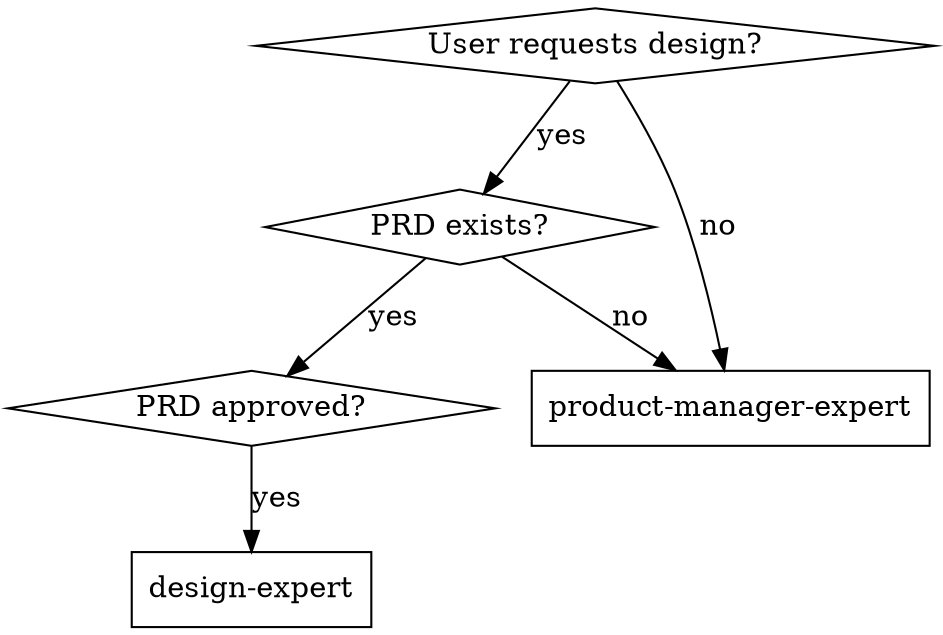

# Design Expert

## Overview

Generate executable design specifications from approved PRD: conduct design research, define visual system and components, specify interaction rules, deliver actionable design spec for developers.

## Essential Prerequisites

**Before starting, MUST confirm:**
- Target platform (Web/Mobile/Desktop)
- Design preferences (style/brand/competitor references)

**CRITICAL: PRD must exist and be approved.** Use `superpowers:product-manager-expert` first if PRD doesn't exist.

**During execution, MUST use `superpowers:brainstorming`** (or AskUserQuestion) to explore until requirements fully understood.

## When to Use



## Quick Reference

| Phase | Key Activities | Deliverables |
|-------|----------------|--------------|
| **1. Analysis** | Parse PRD, extract goals/users/scenarios | Design objectives, requirements |
| **2. Research** | **MUST use ui-ux-pro-max** (web search as fallback only) | Research findings, direction |
| **3. System** | Define visual system, components, tokens | Color, typography, grid, components |
| **4. Spec Output** | Write DESIGN_SPEC to fixed path | `DESIGN_SPEC.md` in `.agent/superpowers/plan/change/{feature}/` |

## The Process

**Step 1: Requirement Analysis**
- Parse PRD for goals, users, scenarios, scope, constraints
- Define design objectives and success metrics
- Verify PRD is approved

**Step 2: Design Research (REQUIRED)**
- **MUST use ui-ux-pro-max skill** for comprehensive design research
- Invoke: `Skill(skill="ui-ux-pro-max")` with research brief
- Research brief includes: feature name, platform, design preferences, key scenarios
- Receive structured findings: trends, competitors, patterns, recommendations
- **Fallback only if ui-ux-pro-max unavailable:** Use web search tools

**Step 3: Visual System & Components**
- Define information architecture and user flows
- Establish visual system (color/typography/spacing/grid/icons)
- Specify component states (default/hover/disabled/error/focus)
- Establish design tokens and accessibility rules

**Step 4: Generate Design Spec**
- Output DESIGN_SPEC ensuring executability
- Save to `.agent/superpowers/plan/change/{feature}/DESIGN_SPEC.md`
- DESIGN_SPEC and PRD must coexist in same folder

## Design Spec Structure (8 Sections)

| # | Section | Content |
|---|---------|---------|
| 1 | Project Overview | Feature name, platform, design goals, preferences |
| 2 | Users & Scenarios | Personas, key tasks, pain points (references PRD) |
| 3 | Design Research | Industry trends, competitor analysis, direction |
| 4 | IA & Flows | Information architecture, user flows, page inventory |
| 5 | Visual System | Color, typography, grid, spacing, icons, tokens |
| 6 | Components | Base components, business components, states |
| 7 | Interactions | Feedback, motion, error states, accessibility |
| 8 | Assumptions | Items pending validation |

See `./design-spec-template.md` for complete template.

## Key Principles

- **PRD is source of truth** - DESIGN_SPEC implements PRD requirements visually
- **Research-backed decisions** - Use ui-ux-pro-max or web search, never arbitrary
- **Design system and tokens** - Drive consistency and reusability
- **Specify all states** - default/hover/disabled/error/focus for every component
- **Accessibility first** - WCAG contrast, keyboard navigation, screen readers

## Common Mistakes

| Mistake | Fix |
|---------|-----|
| Skip design research | MUST use ui-ux-pro-max OR web search |
| Design outside PRD scope | Surface as scope creep, ask user |
| Vague interaction specs | Write specific timing/state rules |
| Missing component states | Define all 5+ states per component |
| Skip accessibility | Include WCAG contrast ratios, keyboard nav |
| "Make it look good" | Clarify preferences, present 2-3 options |

## Red Flags - Stop and Clarify

- "No research needed, experience is enough"
- "Skip ui-ux-pro-max, I'll just search myself"
- "Only visuals, no interaction rules"
- "Accessibility can come later"
- "Design it, we'll figure out implementation"

**All of these mean: Stop. Return to clarification.**

## Workflow Integration

```
Phase 1: Requirements
└── product-manager-expert → generate PRD
Deliverable: Approved PRD

Phase 2: Design
└── design-expert → generate DESIGN_SPEC from PRD
Deliverable: Design specification

Phase 3: Planning
└── writing-plans → break into tasks
Deliverable: Implementation plan

Phase 4: Execution
└── subagent-driven-development OR executing-plans
Deliverable: Working feature
```

**Shared folder:**
```
.agent/superpowers/plan/change/{feature}/
├── PRD.md            # Requirements source of truth
├── DESIGN_SPEC.md    # Design implementation of PRD
└── CHANGELOG.md      # Track changes
```

## Rationalization Counter-Arguments

| Rationalization | Reality |
|-----------------|---------|
| "Time is tight, just draw interfaces" | Without research and specs, implementation fails. |
| "I know current design trends" | Trends change. Research validates against current standards. |
| "ui-ux-pro-max takes too long" | Structured research prevents rework. The time investment pays off. |
| "Specs are too heavy, skip for now" | Specs are prerequisite for consistency and reusability. |

## ui-ux-pro-max Integration (Quick Reference)

**When to invoke:** Step 2 (Design Trend Research)

**Invocation:**
```
Skill(skill="ui-ux-pro-max")
```

**Research Brief:**
```
Product/Feature: {name}
Platform: {Web/Mobile/Desktop}
Design Preferences: {style/brand/competitors}
Key Scenarios: {from PRD}

Research focus:
1. Industry design trends
2. Competitor analysis (visual, layout, interactions)
3. Borrowable patterns
4. Design direction recommendations
```

**Expected Output:** Structured findings (trends, competitors, patterns, recommendations)

**Fallback if unavailable:** Use web search tools, document in DESIGN_SPEC
