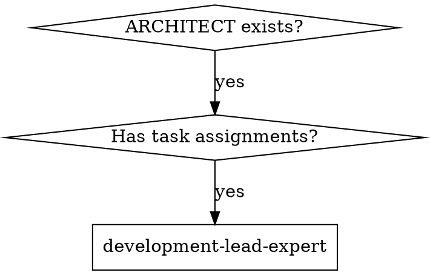

# Development Lead Expert

## Overview

Coordinate development execution based on ARCHITECT.md by extracting task assignments, creating development plans, and dispatching implementer subagents with strict constraints. Follows subagent-driven-development pattern with two-stage reviews.

**CRITICAL: Before execution, MUST confirm: PRD.md, DESIGN_SPEC.md, ARCHITECT.md paths exist and are complete.**
**During execution, MUST use superpowers:brainstorming to explore all relevant points until requirements are fully understood.**

## Execution Mode Declaration

<EXTREMELY_IMPORTANT>
**This is an EXECUTION skill, not a DIALOGUE skill!**

**Core Requirements:**
- Output MUST include actual Task tool calls
- NOT "suggestions" or "plans" - MUST execute immediately
- Outputting "I will call..." without actual calling = **execution failure**

**Execution Verification:**
After completing this skill, check if output contains:
```
Task(tool="implementer-prompt", ...)
```
If no actual Task tool calls are included, execution is incomplete.
</EXTREMELY_IMPORTANT>

## Core Capabilities

- **Development plan generation** - Extract task list, dependencies, and skill assignments from ARCHITECT, output DEVELOPMENT_PLAN.md
- **Task orchestration** - Identify parallel task groups based on dependencies, use Task tool for parallel subagent dispatch
- **Constraint delivery** - Define file/module lists clearly, limit context scope, strictly constrain subagent modification boundaries
- **Progress tracking** - Use TodoWrite to continuously update task status, support resume capability
- **Exception handling** - Interactive error handling for subagent failures (stop/skip/retry/user input)

## The Process

**Step 1: Input Validation & Context Loading**
- Get feature/module name (English directory name)
- Confirm PRD.md, DESIGN_SPEC.md, ARCHITECT.md paths exist and are complete
- Parse "Development Division & Milestones" section from ARCHITECT
- Identify key features and corresponding subagent assignments
- Mark gaps as "Assumption + Validation Plan"

**Step 2: Development Plan Generation**
- Read task list and skill assignments from ARCHITECT
- Generate parallel-execution task groups based on dependencies from ARCHITECT
- Output DEVELOPMENT_PLAN.md with fixed structure
- Save path: `.claude/superpowers/plan/change/{feature}/DEVELOPMENT_PLAN.md` (same directory as PRD, DESIGN_SPEC, ARCHITECT)

**Step 3: Task Tracking Initialization**

<EXTREMELY_IMPORTANT>
**Important: TodoWrite is for task tracking, NOT task assignment!**
</EXTREMELY_IMPORTANT>

- Use TodoWrite to create task list, each task contains: content, activeForm, status
- Mark task dependencies and priorities (P0/P1/P2)
- Initial status: all tasks are pending

**Task Assignment Source:**
- **Subagent assignments come from ARCHITECT.md "Development Division & Milestones" section**
- **architect-expert has already marked which task is executed by which subagent or main agent**
- Read "Responsible Subagent" field for each task in ARCHITECT.md:
  - **Specific subagent marked** (e.g., frontend-developer): Use Task tool to call
  - **"Main agent" or "Use main agent" marked**: Main agent executes directly
- **TodoWrite only tracks progress, doesn't mean main agent executes all tasks**

**Step 4: Parallel Task Execution**

<EXTREMELY_IMPORTANT>
**Warning: Planning ≠ Execution! MUST immediately call Task tool to start subagents!**

**Core Principles:**
- MUST NOT output task planning without executing calls
- Each batch MUST immediately use Task tool to call subagents in next message
- Call format: Use Task tool, specify implementer-prompt template with task context
- Prohibit using "execute later", "next step execute" delayed wording
- This step's output MUST contain actual Task tool calls, not just descriptions

**Execution Method (per ARCHITECT.md assignment):**
- **Tasks marked as specific subagent**: MUST use Task tool to call that subagent
- **Tasks marked as "Main agent"**: Main agent executes directly

**Prohibited Behaviors:**
- **Prohibit main agent from executing tasks marked as specific subagents in ARCHITECT.md**
- **Prohibit skipping Task tool calls and coding tasks with subagents yourself**
- **Prohibit changing subagent-marked tasks to main agent execution**
</EXTREMELY_IMPORTANT>

- Identify parallel-executable task groups (no dependencies)
- Execute by task grouping:
  - **Subagent-marked tasks**: Use Task tool single-message multi-call for parallel execution
  - **Main agent-marked tasks**: Main agent executes directly
- For each subagent call, pass:
  - Task goal and acceptance criteria
  - Allowed file path list (use Glob to verify existence)
  - Allowed module name list
  - Context limits (extract relevant section content from ARCHITECT.md)
  - Input document reference

**Step 5: Progress Tracking & Error Handling**

<EXTREMELY_IMPORTANT>
**Important: Auto-continue after task completion, don't wait for user to say "continue"!**
</EXTREMELY_IMPORTANT>

- Immediately update TodoWrite status to completed after each task
- **Immediately update task status in DEVELOPMENT_PLAN.md after each task**
- **After task success, auto-judge and execute next task, don't stop after outputting summary**
- **Don't output "Task X completed, continue?" type prompts**
- **Only stop when encountering errors or needing user decisions**

**Error Handling** (only on failure):
- Use AskUserQuestion for interactive handling:

| Option | Description | Follow-up Action |
|--------|-------------|-------------------|
| **Stop** | Abort entire development flow | Save current progress, wait for user instructions |
| **Skip** | Skip current task, continue other non-dependent tasks | Mark task as skipped, continue execution |
| **Retry** | Re-execute current task | Call subagent again, configurable retry count |
| **User Input** | Let user provide additional context or guidance | Wait for user input, decide follow-up based on input |

**Auto-continue Conditions:**
- All tasks in current batch completed
- No stop-required red flags encountered
- Next batch tasks exist → **Auto-continue execute next batch**

**Step 6: Completion Summary**
- After all tasks complete, generate development summary report
- Mark completed deliverables and unresolved issues
- Output execution record to DEVELOPMENT_PLAN.md

## Subagent Constraint Method

### Constraint Principle: Combine Both

**1. File/Module List Constraints**
- Explicitly list allowed file paths and module names
- Use Glob tool to verify file existence
- Prohibit subagents from modifying files outside constraint scope

**2. Context Scope Limits**
- Extract current task-related section content from ARCHITECT.md
- Pass only necessary context to subagents
- Avoid passing full documents causing subagents to "overstep boundaries"

### Example Call Method

```markdown
Call frontend-developer subagent:
- Task goal: Implement user login page
- Allowed files: src/pages/LoginPage.vue, src/components/LoginForm.vue
- Allowed modules: HomePage, UserProfile
- Constraint scope: Only handle login form logic, no permission verification
- Input document: ARCHITECT.md Section 6.1 content
- Acceptance criteria: Form validation, submit API, error handling
```

## Parallel Execution Strategy

### Task Dependency Identification
- Extract dependencies from ARCHITECT.md "Development Division & Milestones"
- Build task dependency graph

### Parallel Execution Rules
- Tasks without dependencies go into same batch, parallel execution
- Tasks with dependencies execute serially
- Use Task tool single-message multi-call for parallel

### Example

```
Batch 1 (Parallel):
- frontend-developer: Login page
- multi-platform-developer: Home navigation

Batch 2 (Depends on Batch 1):
- frontend-developer: Post-login redirect logic
```

## DEVELOPMENT_PLAN.md Document Structure

```markdown
# Development Plan

> Feature/Module: {feature name}
> Path: .claude/superpowers/plan/change/{feature}/DEVELOPMENT_PLAN.md
> Related: .claude/superpowers/plan/change/{feature}/PRD.md
> Related: .claude/superpowers/plan/change/{feature}/DESIGN_SPEC.md
> Related: .claude/superpowers/plan/change/{feature}/ARCHITECT.md

## 1. Development Overview
- Feature/module name
- Development goals
- Success criteria
- Constraints (time/resource/technical)

## 2. Task Groups & Dependencies
- Task Group A (parallel)
- Task Group B (depends on A)
- Task Group C (depends on A/B)

## 3. Detailed Task List
### 3.1 {Task Name}
- **Responsible Subagent**: frontend-developer / multi-platform-developer / other
- **Priority**: P0 / P1 / P2
- **Dependencies**: None / Depends on Task X
- **Input Document**: ARCHITECT.md Section X
- **Output Deliverables**: Specific file/module list
- **Constraint Scope**:
  - Allowed files: `src/pages/...`
  - Allowed modules: `HomePage`, `UserProfile`
  - Context limit: Only handle login-related features
- **Acceptance Criteria**:
- **Status**: pending / in_progress / completed / skipped / failed

## 4. Subagent Dispatch Mapping
| ARCHITECT Section | Responsible Subagent | Task ID |
|---|---|---|
| 6.1 User Login | frontend-developer | 3.1 |
| 6.2 Cross-platform Home | multi-platform-developer | 3.2 |

## 5. Risks & Mitigations
- Risk items
- Mitigation measures
- Backup plans

## 6. Task Tracking

### Status Legend
- [ ] pending - To execute
- [⚙️] in_progress - Executing
- [✓] completed - Completed
- [⊘] skipped - Skipped
- [✗] failed - Failed

### Task Progress

#### Batch 1 (Parallel)
- [ ] Task 3.1: Login page (frontend-developer)
- [ ] Task 3.2: Home navigation (multi-platform-developer)

#### Batch 2 (Depends on Batch 1)
- [ ] Task 3.3: Post-login redirect (frontend-developer)

### Execution Record
| Time | Task | Status | Notes |
|------|------|--------|-------|
| YYYY-MM-DD HH:mm | Task 3.1 | in_progress | Started |
| YYYY-MM-DD HH:mm | Task 3.1 | completed | Completed |
```

## Conversation Round Execution Mechanism

<EXTREMELY_IMPORTANT>
**Important: Task tool executes based on conversation rounds, no special "monitoring" mechanism needed!**
</EXTREMELY_IMPORTANT>

### Execution Model

This skill uses **batch synchronous conversation round model**:

```
┌─────────────────────────────────────────────────────────┐
│ Round N: Parent skill calls subagents                    │
│ development-lead-expert output:                           │
│   "Starting Batch 1 parallel tasks:"                      │
│   Task(tool="implementer-prompt", prompt="...")           │
│   Task(tool="implementer-prompt", prompt="...")           │
└─────────────────────────────────────────────────────────┘
                          ↓
┌─────────────────────────────────────────────────────────┐
│ Round N+1: Subagents execute and output results          │
│ AI executes tasks per implementer-prompt instructions   │
│ AI executes tasks per implementer-prompt instructions   │
│ Output: Subagent execution results, code, reports        │
└─────────────────────────────────────────────────────────┘
                          ↓
┌─────────────────────────────────────────────────────────┐
│ Round N+2: Parent skill continues processing results    │
│ development-lead-expert auto-continues:                  │
│   1. Read subagent outputs from conversation history     │
│   2. Update TodoWrite status to completed               │
│   3. Check if next batch exists                         │
│   4. If yes, continue calling next batch subagents      │
└─────────────────────────────────────────────────────────┘
```

### Key Points

1. **No "monitoring" needed**
   - Task tool executes in current conversation context
   - Subagent outputs visible to parent skill in next round
   - Natural conversation flow, no special monitoring/polling

2. **Results auto-visible**
   - Subagent execution results appear in conversation history
   - Parent skill gets subagent outputs by reading conversation history
   - No extra "return" or "notify" mechanism needed

3. **Continue trigger**
   - When all subagents complete, AI auto-continues parent skill
   - Parent skill decides next step by checking conversation history and TodoWrite
   - No manual "continue" trigger needed from user

4. **Batch wait mechanism**
   - After calling batch of subagents, wait for all to complete
   - Process all results together in next round
   - Then judge if need to start next batch

## Subagent Call Mandatory Rules

<EXTREMELY_IMPORTANT>
**Core Principle: Planning ≠ Execution!**
</EXTREMELY_IMPORTANT>

### Mandatory Calls

1. **Prohibit planning without execution**
   - MUST NOT output "I will call XXX subagent", "Next call XXX"
   - MUST actually use Task tool in next message to call subagents

2. **Immediate execution principle**
   - After each batch task planning completes, MUST call immediately in next message
   - MUST NOT use "later", "next", "next step" delayed wording
   - MUST NOT require user confirmation before execution (unless red flag)

3. **Call format requirements**
   ```
   Use Task tool:
   - tool: "implementer-prompt"
   - prompt: "Task goal, constraint scope, acceptance criteria..."
   ```

### Correct Examples

```
❌ Wrong:
"Next I will call frontend-developer to implement login page."
"Next step: Call multi-platform-developer for home navigation."

✅ Correct:
[Immediately call Task tool in next message]
Task(tool="implementer-prompt", prompt="...")
```

### Execution Verification

After task completion, check:
- [ ] Includes actual Task tool calls in message
- [ ] Tool parameter is correct
- [ ] Passed prompt contains task goal and constraint scope
- [ ] Uses single-message multi-call for parallel

### Mandatory Output Template

<EXTREMELY_IMPORTANT>
**Output format requirement when executing "Parallel Task Execution" step:**

When executing "Parallel Task Execution" step, output must follow:

```
# Batch X: Parallel Execution

**Task List:**
- Task 1: XXX (frontend-developer)
- Task 2: YYY (multi-platform-developer)

**Execute Immediately:**
[MUST include actual Task tool calls here, don't omit]
```

**Prohibited Output:**
```
# Batch X: Planning

"I will call in next step..."
"Next will execute..."
```

**Required Output:**
```
Task(tool="implementer-prompt", prompt="Task: Implement login page
Constraint scope: src/pages/Login.vue
Acceptance criteria: Form validation, submit API")
Task(tool="implementer-prompt", prompt="...")
```

</EXTREMELY_IMPORTANT>

### Subagent Result Reception & Processing

<EXTREMELY_IMPORTANT>
**Parent skill MUST continue processing results after subagent completes!**
</EXTREMELY_IMPORTANT>

#### Reception Mechanism

When subagent completes, results naturally appear in conversation history. Parent skill receives by:

1. **Read conversation history**
   - Check subagent output content in conversation
   - Find files, code, reports generated by subagent
   - Confirm if subagent completed task

2. **Verify completion status**
   - Check if subagent output expected deliverables
   - Verify if deliverables meet acceptance criteria
   - Confirm if errors or exceptions

3. **Update task status**
   - Use TodoWrite to mark corresponding task as completed
   - Record task output results
   - Update execution record in DEVELOPMENT_PLAN.md

#### Processing Flow

<EXTREMELY_IMPORTANT>
**Important: Auto-continue next batch after processing, don't wait for user "continue"!**
</EXTREMELY_IMPORTANT>

```
Round N+2: Parent skill processes subagent results
├── Step 1: Read conversation history, get all subagent outputs
├── Step 2: Verify each subagent completion status
│   ├── Success: Mark completed, record output
│   ├── Failure: Use AskUserQuestion to select handling
│   └── Partial: Ask user if accept or retry
├── Step 3: Update TodoWrite status
├── Step 4: Update DEVELOPMENT_PLAN.md execution record
├── Step 5: Judge if need next batch
│   ├── Yes: **Auto-continue execute next batch** (don't wait for user "continue")
│   └── No: Generate development summary report
└── Step 6: Only output summary after all tasks complete
```

**Prohibited Behaviors:**
- **Don't output summary and stop after each batch**
- **Don't ask "Continue next batch?"**
- **Only stop when encountering errors**

#### Continue Execution Conditions

Parent skill continues next batch when:

1. **All tasks in current batch completed** (completed or skipped)
2. **No stop-required red flags encountered**
3. **Next batch tasks exist to execute**

#### Error Handling

When subagent execution fails:

1. **Analyze failure reason**
   - Read subagent error message
   - Judge if constraint issue, dependency issue, or other

2. **Interactive handling**
   - Use AskUserQuestion to provide options:
     - **Stop**: Abort entire development flow
     - **Skip**: Skip current task, continue other non-dependent tasks
     - **Retry**: Re-execute after adjusting parameters
     - **User Input**: Wait for user to provide additional guidance

3. **Update status**
   - Update task status based on user selection
   - Record in execution record

## Key Method Quick Reference

| Purpose | Method/Tool | Output |
|---------|------------|--------|
| Input validation | Read + Glob | Confirm documents exist and complete |
| Plan generation | Parse ARCHITECT + Write | DEVELOPMENT_PLAN.md |
| Task tracking | TodoWrite | Task status list |
| Parallel calls | Task tool (single-message multi-call) | Multi-subagent parallel execution |
| Constraint delivery | Read (extract relevant sections) | Scoped context |
| Error handling | AskUserQuestion | User selects handling method |

## Key Principles

- **Confirm ARCHITECT.md exists** with "Development Division & Milestones" section before starting
- **Use TodoWrite to track all task statuses**
- **Use superpowers:brainstorming to ask** until requirements fully clear
- **Don't skip subagent constraint scope**
- **Don't pass full ARCHITECT.md to subagents** - only relevant sections
- **Support interactive error handling** (4 options: stop/skip/retry/user input)
- **Intelligently parallel execute tasks** based on dependencies
- **Don't guess API behavior or business rules** - ask or mark as assumptions
- **Clarify with user before executing** when requirements unclear

## Forbidden Behaviors

**NEVER:**
- Start coding without creating DEVELOPMENT_PLAN.md
- Pass full ARCHITECT.md to subagents - only relevant sections
- Execute all tasks serially - identify parallel tasks
- Auto-skip on subagent failure - interactively ask user to choose
- Skip task status tracking - use TodoWrite continuously
- Force parallel execution ignoring dependencies - analyze dependency graph
- Output task planning without using Task tool to call subagents (Planning ≠ Execution!)
- Use "execute later", "next step execute" delayed wording without immediate calling
- Execute ARCHITECT-marked subagent tasks yourself (main agent)
- Skip Task tool calls and execute subagent tasks yourself
- Output summary and stop after task completion
- Ask "Continue next batch?" after each batch

**INSTEAD:**
- Must generate development plan document first
- Only pass relevant section content
- Identify no-dependency tasks, parallel execute
- Interactively let user choose handling on failure
- Use TodoWrite to continuously update status
- Analyze dependency graph, group and execute correctly
- Must include actual Task tool calls in output
- Immediately call Task tool in next message
- Respect ARCHITECT assignments
- Use Task tool to call assigned subagents
- Auto-continue next batch after completion
- Only stop on errors

## Common Errors and Corrections

| Error | Correction |
|-------|------------|
| Start coding without plan | Must generate DEVELOPMENT_PLAN.md first |
| Pass full ARCHITECT to subagents | Only pass relevant sections |
| All tasks serial execution | Identify parallel tasks, execute in parallel |
| Auto-skip on subagent failure | Interactive user selection for handling |
| No task status tracking | Use TodoWrite continuously update |
| Force parallel ignoring dependencies | Analyze dependency graph, correct grouping |

## Rationalization Counter-Arguments

| Rationalization | Reality |
|-----------------|---------|
| "ARCHITECT detailed enough, no development plan needed" | Development plan is execution basis, must specify constraints and progress |
| "Subagents will judge what to do themselves" | Must pass clear constraint scope and context |
| "Just retry on failure, no need to ask user" | User needs to know and decide handling |
| "Serial execution more reliable" | Parallel no-dependency tasks improve efficiency |
| "Constraints too strict, limit subagent performance" | Strict constraints necessary to ensure development follows design |

## Red Flags (Stop and Return to Clarification)

**Stop when:**
- ARCHITECT.md doesn't exist or "Development Division & Milestones" section missing
- No constraint parameters passed when calling subagents
- Skip TodoWrite progress tracking
- Auto-retry on subagent failure without asking user
- Force parallel execution ignoring task dependencies
- Execute without clarifying when requirements unclear
- **Only output task planning without using Task tool to call subagents** (Planning ≠ Execution!)
- **Use "execute later", "next step execute" delayed wording without immediate calling**
- **Main agent executes ARCHITECT-marked subagent tasks**
- **Skip Task tool calls and execute subagent tasks yourself**
- **Output summary and stop after task completion**
- **Ask "Continue next batch?" after each batch**

## Integration with Superpowers Workflow

### When to Use development-lead-expert



### Workflow Integration

**Phase 1-3: PRD, Design, Architecture**
- product-manager-expert generates PRD
- design-expert generates DESIGN_SPEC
- architect-expert generates ARCHITECT with task assignments

**Phase 4: Development Coordination**
- **development-lead-expert** (current skill)
  - Extracts tasks from ARCHITECT
  - Generates DEVELOPMENT_PLAN.md
  - Dispatches implementer subagents
  - Tracks progress with TodoWrite

**Phase 5: Implementation**
- Implementer subagents execute tasks
- Two-stage reviews: spec compliance → code quality

### Skill Chain Relationship

```
product-manager-expert
       ↓ (PRD.md)
design-expert
       ↓ (DESIGN_SPEC.md)
architect-expert
       ↓ (ARCHITECT.md with task assignments)
development-lead-expert  ← Current skill
       ↓ (DEVELOPMENT_PLAN.md)
  ┌────┴────┐
  ↓         ↓
frontend-  multi-platform-
developer  developer
subagent  subagent
```

**Invocation timing:** After architect-expert completes ARCHITECT.md

**Dispatched subagents:**
- frontend-developer: Handle web frontend tasks
- multi-platform-developer: Handle iOS/Android cross-platform tasks
- Other subagents as specified in ARCHITECT.md
