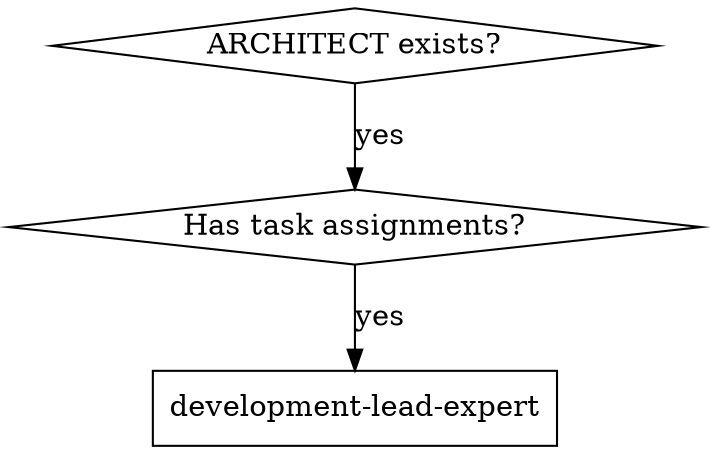

# Development Lead Expert

## Overview

Coordinate development execution based on ARCHITECT.md by extracting task assignments, creating development plans, and dispatching implementer subagents with strict constraints. Follows subagent-driven-development pattern with two-stage reviews.

**CRITICAL: Before execution, MUST confirm: PRD.md, DESIGN_SPEC.md, ARCHITECT.md paths exist and are complete.**
**During execution, MUST use superpowers:brainstorming to explore all relevant points until requirements are fully understood.**

## Execution Mode Declaration

<EXTREMELY_IMPORTANT>
**This is an EXECUTION skill, not a DIALOGUE skill!**

**Core Requirements:**
- Output MUST include actual Task tool calls
- NOT "suggestions" or "plans" - MUST execute immediately
- Outputting "I will call..." without actual calling = **execution failure**

**Execution Verification:**
After completing this skill, check if output contains:
```
Task(tool="implementer-prompt", ...)
```
If no actual Task tool calls are included, execution is incomplete.
</EXTREMELY_IMPORTANT>

## Core Capabilities

- **Development plan generation** - Extract task list, dependencies, and skill assignments from ARCHITECT, output DEVELOPMENT_PLAN.md
- **Task orchestration** - Execute tasks serially in dependency order, use Task tool for subagent dispatch one by one
- **Constraint delivery** - Define file/module lists clearly, limit context scope, strictly constrain subagent modification boundaries
- **Progress tracking** - Use TodoWrite to continuously update task status, support resume capability
- **Exception handling** - Interactive error handling for subagent failures (stop/skip/retry/user input)

## Architecture Priority Rules

<EXTREMELY_IMPORTANT>
**CRITICAL: ARCHITECT.md is the source of truth - NEVER re-ask what's already defined there!**
</EXTREMELY_IMPORTANT>

### What's Already Defined in ARCHITECT (DO NOT Re-ask)

**Technology Stack (Section 8) - Defined & Locked:**
- Frontend framework, version, build tools
- Backend framework, language, runtime
- Database, cache, message queue choices
- Deployment infrastructure

**Technology Constraints (Section 8.6) - MANDATORY Commands:**
- Required commands for initialization, build, test
- Deprecated/prohibited methods explicitly marked
- Version requirements with minimum and recommended versions
- Best practice requirements

**Module Boundaries (Section 3) - Defined:**
- Which modules exist, their responsibilities
- Module dependencies and interfaces

**Data Models (Section 4) - Defined:**
- Core entities and their fields
- Data relationships and flows

**Feature/Page Design (Section 6) - Defined:**
- User flows, page components, interactions
- API endpoints and contracts

**Task Assignments (Section 11) - Defined:**
- Which subagent handles which task
- Task dependencies and execution order

### What SHOULD Be Asked (Implementation Details Only)

**Ask ONLY when ARCHITECT is silent or ambiguous:**

| Category | Examples |
|----------|----------|
| **Implementation nuances** | "Use async/await or promises?" "Component class or functional?" |
| **Code organization** | "File structure within module?" "Naming conventions?" |
| **Edge cases** | "Handle null/undefined how?" "Error recovery strategy?" |
| **Configuration details** | "Environment variable names?" "Config file format?" |
| **Testing approach** | "Unit test framework specifics?" "Mock strategy?" |
| **Validation rules** | "Email regex pattern?" "Password requirements?" |

### Decision Framework Before Asking

```
Before asking ANY question:
  ↓
Is this defined in ARCHITECT.md?
  ├─ YES → **USE IT** (don't ask)
  └─ NO  → Is this an implementation detail?
      ├─ YES → **ASK USER**
      └─ NO  → Is this a fundamental design choice?
          ├─ YES → **STOP** (should be in ARCHITECT, ask architect to update)
          └─ NO  → Make reasonable assumption and document
```

### Examples of WRONG vs RIGHT Questions

**❌ WRONG: Re-asking defined architecture**
```
"Which frontend framework should we use?" (ARCHITECT Section 8.1)
"Which database for this feature?" (ARCHITECT Section 8.3)
"What's the command to initialize?" (ARCHITECT Section 8.6)
"Which subagent should do this task?" (ARCHITECT Section 11)
```

**✅ RIGHT: Asking implementation details**
```
"Within the React component, use hooks or class-based?"
"For form validation, use Yup or Zod schema?"
"Error handling: retry with backoff or fail fast?"
"File naming: camelCase or kebab-case?"
```

### Reading ARCHITECT Correctly

**When extracting constraints, read these sections FIRST:**

1. **Section 8.6: Technology Constraints** - Extract required commands
2. **Section 8: Technology Selection** - Extract stack choices
3. **Section 11: Development Division** - Extract task assignments
4. **Section 6: Feature Design** - Extract implementation scope
5. **Section 3: Module Boundaries** - Extract allowed files/modules

**Only AFTER reading these sections, ask:**
- "ARCHITECT says use React, but should we use TypeScript or JavaScript?"
- "ARCHITECT specifies PostgreSQL, but what's the connection pool size?"

### Red Flags: Re-asking Architecture

**Stop yourself when:**
- [ ] Asking about technology choice (already in Section 8)
- [ ] Asking about initialization command (already in Section 8.6)
- [ ] Asking which subagent for task (already in Section 11)
- [ ] Asking about module structure (already in Section 3)
- [ ] Asking about data models (already in Section 4)

**Instead:**
- Read ARCHITECT again more carefully
- Extract the specific constraint/command needed
- Pass it directly to subagent in prompt

## The Process

**Step 1: Input Validation & Context Loading**
- Get feature/module name (English directory name)
- Confirm PRD.md, DESIGN_SPEC.md, ARCHITECT.md paths exist and are complete
- **CRITICAL: Read ARCHITECT.md sections in this order FIRST:**
  1. Section 8.6: Technology Constraints and Required Commands (extract all MANDATORY commands)
  2. Section 8: Technology Selection (extract stack choices)
  3. Section 11: Development Division and Milestones (extract task assignments)
  4. Section 6: Feature/Page-Level Architecture Design (extract implementation scope)
  5. Section 3: System Layers and Module Boundaries (extract allowed files/modules)
- **Extract and document:**
  - Technology constraints (required commands, prohibited methods)
  - Task assignments (which subagent for which task)
  - Module boundaries (allowed files and modules)
  - Dependencies (task execution order)
- Identify key features and corresponding subagent assignments
- Mark gaps as "Assumption + Validation Plan"

**Step 2: Development Plan Generation**
- Read task list and skill assignments from ARCHITECT
- Generate serial execution order based on dependencies from ARCHITECT
- Output DEVELOPMENT_PLAN.md with fixed structure
- Save path: `.agent/superpowers/plan/change/{feature}/DEVELOPMENT_PLAN.md` (same directory as PRD, DESIGN_SPEC, ARCHITECT)

**Step 3: Task Tracking Initialization**

<EXTREMELY_IMPORTANT>
**Important: TodoWrite is for task tracking, NOT task assignment!**
</EXTREMELY_IMPORTANT>

- Use TodoWrite to create task list, each task contains: content, activeForm, status
- Mark task dependencies and priorities (P0/P1/P2)
- Initial status: all tasks are pending

**Task Assignment Source:**
- **Subagent assignments come from ARCHITECT.md "Development Division & Milestones" section**
- **architect-expert has already marked which task is executed by which subagent or main agent**
- Read "Responsible Subagent" field for each task in ARCHITECT.md:
  - **Specific subagent marked** (e.g., frontend-developer): Use Task tool to call
  - **"Main agent" or "Use main agent" marked**: Main agent executes directly
- **TodoWrite only tracks progress, doesn't mean main agent executes all tasks**

**Step 4: Serial Task Execution**

<EXTREMELY_IMPORTANT>
**Warning: Planning ≠ Execution! MUST immediately call Task tool to start subagents!**

**Core Principles:**
- MUST NOT output task planning without executing calls
- Each task MUST immediately use Task tool to call subagent in next message
- Call format: Use Task tool, specify implementer-prompt template with task context
- Prohibit using "execute later", "next step execute" delayed wording
- This step's output MUST contain actual Task tool calls, not just descriptions
- **Execute tasks ONE BY ONE in serial order**, wait for completion before next task

**Execution Method (per ARCHITECT.md assignment):**
- **Tasks marked as specific subagent**: MUST use Task tool to call that subagent
- **Tasks marked as "Main agent"**: Main agent executes directly

**Prohibited Behaviors:**
- **Prohibit main agent from executing tasks marked as specific subagents in ARCHITECT.md**
- **Prohibit skipping Task tool calls and coding tasks with subagents yourself**
- **Prohibit changing subagent-marked tasks to main agent execution**
- **Prohibit parallel execution - all tasks must execute serially**
</EXTREMELY_IMPORTANT>

- Execute tasks in serial order based on dependency graph from ARCHITECT.md
- Execute ONE task at a time:
  - **Subagent-marked tasks**: Use Task tool to call subagent
  - **Main agent-marked tasks**: Main agent executes directly
- Wait for task completion before starting next task
- For each subagent call, pass:
  - Task goal and acceptance criteria
  - **Technology constraints and required commands** (extract from ARCHITECT.md Section 8.6)
  - Allowed file path list (use Glob to verify existence)
  - Allowed module name list
  - Context limits (extract relevant section content from ARCHITECT.md)
  - Input document reference

**Step 5: Progress Tracking & Error Handling**

<EXTREMELY_IMPORTANT>
**Important: Auto-continue after task completion, don't wait for user to say "continue"!**
</EXTREMELY_IMPORTANT>

- Immediately update TodoWrite status to completed after each task
- **Immediately update task status in DEVELOPMENT_PLAN.md after each task**
- **After task success, auto-continue to next task in serial order**
- **Don't output "Task X completed, continue?" type prompts**
- **Only stop when encountering errors or needing user decisions**

**Error Handling** (only on failure):
- Use AskUserQuestion for interactive handling:

| Option | Description | Follow-up Action |
|--------|-------------|-------------------|
| **Stop** | Abort entire development flow | Save current progress, wait for user instructions |
| **Skip** | Skip current task, continue to next task in order | Mark task as skipped, continue execution |
| **Retry** | Re-execute current task | Call subagent again, configurable retry count |
| **User Input** | Let user provide additional context or guidance | Wait for user input, decide follow-up based on input |

**Auto-continue Conditions:**
- Current task completed successfully
- No stop-required red flags encountered
- More tasks exist in execution order → **Auto-continue to next task**

**Step 6: Completion Summary**
- After all tasks complete, generate development summary report
- Mark completed deliverables and unresolved issues
- Output execution record to DEVELOPMENT_PLAN.md

## Subagent Constraint Method

### Constraint Principle: Combine Three Layers

**1. Technology Constraints (NEW - Prevents using outdated commands)**
- Extract from ARCHITECT.md Section 8.6 "Technology Constraints and Required Commands"
- Pass MANDATORY commands, versions, and prohibited methods
- Include reference links for verification
- Mark deprecated commands explicitly

**2. File/Module List Constraints**
- Explicitly list allowed file paths and module names
- Use Glob tool to verify file existence
- Prohibit subagents from modifying files outside constraint scope

**3. Context Scope Limits**
- Extract current task-related section content from ARCHITECT.md
- Pass only necessary context to subagents
- Avoid passing full documents causing subagents to "overstep boundaries"

### Example Call Method

```markdown
Call multi-platform-developer subagent:
- Task goal: Initialize React Native project
- **Technology Constraints (from ARCHITECT Section 8.6):**
  - Required: `npx react-native@latest init MyAppName`
  - Prohibited: `react-native init` (deprecated)
  - Reference: https://reactnative.dev/docs/environment-setup
- Allowed files: MyReactNativeApp/**, package.json
- Allowed modules: App, Navigation
- Constraint scope: Only initialize project, don't implement features
- Input document: ARCHITECT.md Section 6.1 content
- Acceptance criteria:
  - [ ] Used `npx react-native@latest` (verified)
  - [ ] Project structure created correctly
  - [ ] iOS and Android folders exist
```

## Serial Execution Strategy

### Task Dependency Identification
- Extract dependencies from ARCHITECT.md "Development Division & Milestones"
- Build task dependency graph
- Sort tasks topologically to determine serial execution order

### Serial Execution Rules
- **ALL tasks execute serially, ONE BY ONE**
- Execute in dependency order: dependencies first, then dependents
- Wait for each task to complete before starting next task
- Use Task tool to call subagent for each task individually

### Example

```
Task 1 (No dependencies):
- frontend-developer: Login page
→ Execute and wait for completion

Task 2 (No dependencies):
- multi-platform-developer: Home navigation
→ Execute and wait for completion

Task 3 (Depends on Task 1):
- frontend-developer: Post-login redirect logic
→ Execute and wait for completion
```

## DEVELOPMENT_PLAN.md Document Structure

```markdown
# Development Plan

> Feature/Module: {feature name}
> Path: .agent/superpowers/plan/change/{feature}/DEVELOPMENT_PLAN.md
> Related: .agent/superpowers/plan/change/{feature}/PRD.md
> Related: .agent/superpowers/plan/change/{feature}/DESIGN_SPEC.md
> Related: .agent/superpowers/plan/change/{feature}/ARCHITECT.md

## 1. Development Overview
- Feature/module name
- Development goals
- Success criteria
- Constraints (time/resource/technical)

## 2. Execution Order
Tasks execute in serial order based on dependencies:
1. Task 1 (No dependencies)
2. Task 2 (No dependencies)
3. Task 3 (Depends on Task 1)
4. Task 4 (Depends on Task 2)

## 3. Detailed Task List
### 3.1 {Task Name}
- **Responsible Subagent**: frontend-developer / multi-platform-developer / other
- **Priority**: P0 / P1 / P2
- **Dependencies**: None / Depends on Task X
- **Input Document**: ARCHITECT.md Section X
- **Output Deliverables**: Specific file/module list
- **Constraint Scope**:
  - Allowed files: `src/pages/...`
  - Allowed modules: `HomePage`, `UserProfile`
  - Context limit: Only handle login-related features
- **Acceptance Criteria**:
- **Status**: pending / in_progress / completed / skipped / failed

## 4. Subagent Dispatch Mapping
| ARCHITECT Section | Responsible Subagent | Task ID |
|---|---|---|
| 6.1 User Login | frontend-developer | 3.1 |
| 6.2 Cross-platform Home | multi-platform-developer | 3.2 |

## 5. Risks & Mitigations
- Risk items
- Mitigation measures
- Backup plans

## 6. Task Tracking

### Status Legend
- [ ] pending - To execute
- [⚙️] in_progress - Executing
- [✓] completed - Completed
- [⊘] skipped - Skipped
- [✗] failed - Failed

### Task Progress (Serial Execution)
- [ ] Task 3.1: Login page (frontend-developer)
- [ ] Task 3.2: Home navigation (multi-platform-developer)
- [ ] Task 3.3: Post-login redirect (frontend-developer) [depends on 3.1]

### Execution Record
| Time | Task | Status | Notes |
|------|------|--------|-------|
| YYYY-MM-DD HH:mm | Task 3.1 | in_progress | Started |
| YYYY-MM-DD HH:mm | Task 3.1 | completed | Completed |
| YYYY-MM-DD HH:mm | Task 3.2 | in_progress | Started |
| YYYY-MM-DD HH:mm | Task 3.2 | completed | Completed |
```

## Conversation Round Execution Mechanism

<EXTREMELY_IMPORTANT>
**Important: Task tool executes based on conversation rounds, no special "monitoring" mechanism needed!**
</EXTREMELY_IMPORTANT>

### Execution Model

This skill uses **serial synchronous conversation round model**:

```
┌─────────────────────────────────────────────────────────┐
│ Round N: Parent skill calls first subagent               │
│ development-lead-expert output:                          │
│   "Starting Task 1:"                                     │
│   Task(tool="implementer-prompt", prompt="...")          │
└─────────────────────────────────────────────────────────┘
                          ↓
┌─────────────────────────────────────────────────────────┐
│ Round N+1: Subagent executes and outputs result          │
│ AI executes task per implementer-prompt instructions    │
│ Output: Subagent execution result, code, report          │
└─────────────────────────────────────────────────────────┘
                          ↓
┌─────────────────────────────────────────────────────────┐
│ Round N+2: Parent skill continues processing result     │
│ development-lead-expert auto-continues:                  │
│   1. Read subagent output from conversation history      │
│   2. Update TodoWrite status to completed               │
│   3. Check if next task exists                          │
│   4. If yes, continue calling next task subagent        │
└─────────────────────────────────────────────────────────┘
```

### Key Points

1. **No "monitoring" needed**
   - Task tool executes in current conversation context
   - Subagent output visible to parent skill in next round
   - Natural conversation flow, no special monitoring/polling

2. **Results auto-visible**
   - Subagent execution results appear in conversation history
   - Parent skill gets subagent output by reading conversation history
   - No extra "return" or "notify" mechanism needed

3. **Continue trigger**
   - When subagent completes, AI auto-continues parent skill
   - Parent skill decides next step by checking conversation history and TodoWrite
   - No manual "continue" trigger needed from user

4. **Serial execution mechanism**
   - Call ONE subagent at a time
   - Wait for completion before next task
   - Process result, then judge if need to start next task

## Subagent Call Mandatory Rules

<EXTREMELY_IMPORTANT>
**Core Principle: Planning ≠ Execution!**
</EXTREMELY_IMPORTANT>

### Mandatory Calls

1. **Prohibit planning without execution**
   - MUST NOT output "I will call XXX subagent", "Next call XXX"
   - MUST actually use Task tool in next message to call subagent

2. **Immediate execution principle**
   - After current task planning completes, MUST call immediately in next message
   - MUST NOT use "later", "next", "next step" delayed wording
   - MUST NOT require user confirmation before execution (unless red flag)

3. **Call format requirements**
   ```
   Use Task tool:
   - tool: "implementer-prompt"
   - prompt: "Task goal, constraint scope, acceptance criteria..."
   ```

### Correct Examples

```
❌ Wrong:
"Next I will call frontend-developer to implement login page."
"Next step: Call multi-platform-developer for home navigation."

✅ Correct:
[Immediately call Task tool in next message]
Task(tool="implementer-prompt", prompt="...")
```

### Execution Verification

After task completion, check:
- [ ] Includes actual Task tool call in message
- [ ] Tool parameter is correct
- [ ] Passed prompt contains task goal and constraint scope
- [ ] Only ONE subagent call per message (serial execution)

### Mandatory Output Template

<EXTREMELY_IMPORTANT>
**Output format requirement when executing "Serial Task Execution" step:**

When executing "Serial Task Execution" step, output must follow:

```
# Task X: Serial Execution

**Current Task:**
- Task 1: XXX (frontend-developer)

**Execute Immediately:**
[MUST include actual Task tool call here, don't omit]
```

**Prohibited Output:**
```
# Task X: Planning

"I will call in next step..."
"Next will execute..."
```

**Required Output:**
```
Task(tool="implementer-prompt", prompt="Task: Implement login page
Constraint scope: src/pages/Login.vue
Acceptance criteria: Form validation, submit API")
```

</EXTREMELY_IMPORTANT>

### Subagent Result Reception & Processing

<EXTREMELY_IMPORTANT>
**Parent skill MUST continue processing results after subagent completes!**
</EXTREMELY_IMPORTANT>

#### Reception Mechanism

When subagent completes, results naturally appear in conversation history. Parent skill receives by:

1. **Read conversation history**
   - Check subagent output content in conversation
   - Find files, code, reports generated by subagent
   - Confirm if subagent completed task

2. **Verify completion status**
   - Check if subagent output expected deliverables
   - Verify if deliverables meet acceptance criteria
   - Confirm if errors or exceptions

3. **Update task status**
   - Use TodoWrite to mark corresponding task as completed
   - Record task output results
   - Update execution record in DEVELOPMENT_PLAN.md

#### Processing Flow

<EXTREMELY_IMPORTANT>
**Important: Auto-continue next task after processing, don't wait for user "continue"!**
</EXTREMELY_IMPORTANT>

```
Round N+2: Parent skill processes subagent result
├── Step 1: Read conversation history, get subagent output
├── Step 2: Verify subagent completion status
│   ├── Success: Mark completed, record output
│   ├── Failure: Use AskUserQuestion to select handling
│   └── Partial: Ask user if accept or retry
├── Step 3: Update TodoWrite status
├── Step 4: Update DEVELOPMENT_PLAN.md execution record
├── Step 5: Judge if need next task
│   ├── Yes: **Auto-continue execute next task** (don't wait for user "continue")
│   └── No: Generate development summary report
└── Step 6: Only output summary after all tasks complete
```

**Prohibited Behaviors:**
- **Don't output summary and stop after each task**
- **Don't ask "Continue next task?"**
- **Only stop when encountering errors**

#### Continue Execution Conditions

Parent skill continues next task when:

1. **Current task completed** (completed or skipped)
2. **No stop-required red flags encountered**
3. **Next task exists to execute**

#### Error Handling

When subagent execution fails:

1. **Analyze failure reason**
   - Read subagent error message
   - Judge if constraint issue, dependency issue, or other

2. **Interactive handling**
   - Use AskUserQuestion to provide options:
     - **Stop**: Abort entire development flow
     - **Skip**: Skip current task, continue other non-dependent tasks
     - **Retry**: Re-execute after adjusting parameters
     - **User Input**: Wait for user to provide additional guidance

3. **Update status**
   - Update task status based on user selection
   - Record in execution record

## Key Method Quick Reference

| Purpose | Method/Tool | Output |
|---------|------------|--------|
| Input validation | Read + Glob | Confirm documents exist and complete |
| Plan generation | Parse ARCHITECT + Write | DEVELOPMENT_PLAN.md |
| Task tracking | TodoWrite | Task status list |
| Serial calls | Task tool (one call at a time) | Single subagent execution per call |
| Constraint delivery | Read (extract relevant sections) | Scoped context |
| Error handling | AskUserQuestion | User selects handling method |

## Key Principles

- **ARCHITECT.md is the source of truth** - extract and use ALL defined constraints before asking
- **Confirm ARCHITECT.md exists** with all required sections before starting
- **Read ARCHITECT sections in order**: 8.6 → 8 → 11 → 6 → 3 (before asking anything)
- **Use TodoWrite to track all task statuses**
- **Use superpowers:brainstorming to ask** ONLY for implementation details (not architecture)
- **Don't skip subagent constraint scope** - pass tech constraints from ARCHITECT Section 8.6
- **Don't pass full ARCHITECT.md to subagents** - only relevant sections
- **Support interactive error handling** (4 options: stop/skip/retry/user input)
- **Execute tasks serially** one by one in dependency order
- **Don't guess API behavior or business rules** - ask or mark as assumptions
- **Clarify with user before executing** when requirements unclear
- **NEVER re-ask what's defined in ARCHITECT** - use it directly

## Forbidden Behaviors

**NEVER:**
- Start coding without creating DEVELOPMENT_PLAN.md
- **Re-ask what's already defined in ARCHITECT** - read and use it directly
- **Skip reading ARCHITECT Section 8.6** before calling subagents
- Pass full ARCHITECT.md to subagents - only relevant sections
- Execute tasks in parallel - ALL tasks must execute serially
- Auto-skip on subagent failure - interactively ask user to choose
- Skip task status tracking - use TodoWrite continuously
- Ignore task dependencies - execute in correct order
- Output task planning without using Task tool to call subagents (Planning ≠ Execution!)
- Use "execute later", "next step execute" delayed wording without immediate calling
- Execute ARCHITECT-marked subagent tasks yourself (main agent)
- Skip Task tool calls and execute subagent tasks yourself
- Output summary and stop after task completion
- Ask "Continue next task?" after each task

**INSTEAD:**
- Must generate development plan document first
- **Read ARCHITECT sections in order, extract constraints, use them**
- **Always pass Section 8.6 constraints to subagents**
- Only pass relevant section content
- Execute all tasks serially, one by one
- Interactively let user choose handling on failure
- Use TodoWrite to continuously update status
- Respect dependency order from ARCHITECT
- Must include actual Task tool calls in output
- Immediately call Task tool in next message
- Respect ARCHITECT assignments
- Use Task tool to call assigned subagents
- Auto-continue next task after completion
- Only stop on errors

## Common Errors and Corrections

| Error | Correction |
|-------|------------|
| Start coding without plan | Must generate DEVELOPMENT_PLAN.md first |
| **Re-asking ARCHITECT-defined tech choices** | Read ARCHITECT Section 8, use what's defined |
| **Not passing tech constraints to subagent** | Extract Section 8.6, pass in prompt |
| **Asking which subagent for task** | Read ARCHITECT Section 11, use assignment |
| Pass full ARCHITECT to subagents | Only pass relevant sections |
| Tasks parallel execution | Execute all tasks serially in dependency order |
| Auto-skip on subagent failure | Interactive user selection for handling |
| No task status tracking | Use TodoWrite continuously update |
| Ignore dependencies | Respect dependency order from ARCHITECT |

## Rationalization Counter-Arguments

| Rationalization | Reality |
|-----------------|---------|
| "ARCHITECT detailed enough, no development plan needed" | Development plan is execution basis, must specify constraints and progress |
| "Subagents will judge what to do themselves" | Must pass clear constraint scope and context including tech constraints |
| "Just retry on failure, no need to ask user" | User needs to know and decide handling |
| "Serial execution is slower" | Serial execution ensures correctness and avoids conflicts |
| "Constraints too strict, limit subagent performance" | Strict constraints necessary to ensure development follows design |
| "I'll double-check the tech choice with user" | ARCHITECT Section 8 already defines tech stack - use it, don't re-ask |
| "Not sure about the command, better ask" | ARCHITECT Section 8.6 defines required commands - use them |

## Red Flags (Stop and Return to Clarification)

**Stop when:**
- ARCHITECT.md doesn't exist or required sections missing
- No constraint parameters passed when calling subagents
- **Re-asking questions already answered in ARCHITECT**
- **Asking about technology choice defined in Section 8**
- **Asking about command defined in Section 8.6**
- **Asking about task assignment defined in Section 11**
- Skip TodoWrite progress tracking
- Auto-retry on subagent failure without asking user
- Execute tasks in parallel ignoring serial execution requirement
- Execute without clarifying when requirements unclear
- **Only output task planning without using Task tool to call subagents** (Planning ≠ Execution!)
- **Use "execute later", "next step execute" delayed wording without immediate calling**
- **Main agent executes ARCHITECT-marked subagent tasks**
- **Skip Task tool calls and execute subagent tasks yourself**
- **Output summary and stop after task completion**
- **Ask "Continue next task?" after each task**

## Integration with Superpowers Workflow

### When to Use development-lead-expert



### Workflow Integration

**Phase 1-3: PRD, Design, Architecture**
- product-manager-expert generates PRD
- design-expert generates DESIGN_SPEC
- architect-expert generates ARCHITECT with task assignments

**Phase 4: Development Coordination**
- **development-lead-expert** (current skill)
  - Extracts tasks from ARCHITECT
  - Generates DEVELOPMENT_PLAN.md
  - Dispatches implementer subagents
  - Tracks progress with TodoWrite

**Phase 5: Implementation**
- Implementer subagents execute tasks
- Two-stage reviews: spec compliance → code quality

### Skill Chain Relationship

```
product-manager-expert
       ↓ (PRD.md)
design-expert
       ↓ (DESIGN_SPEC.md)
architect-expert
       ↓ (ARCHITECT.md with task assignments)
development-lead-expert  ← Current skill
       ↓ (DEVELOPMENT_PLAN.md)
  ┌────┴────┐
  ↓         ↓
frontend-  multi-platform-
developer  developer
subagent  subagent
```

**Invocation timing:** After architect-expert completes ARCHITECT.md

**Dispatched subagents:**
- frontend-developer: Handle web frontend tasks
- multi-platform-developer: Handle iOS/Android cross-platform tasks
- Other subagents as specified in ARCHITECT.md
