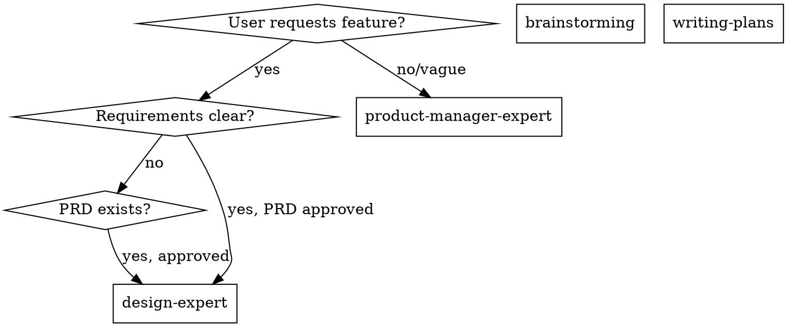

# Product Manager Expert

## Overview

Transform vague requirements into executable PRDs through systematic analysis: clarify problems and goals, complete user/market insights and requirement breakdown, output complete document with acceptance criteria, risks, and resource planning.

## Essential Prerequisites

**Before starting, MUST ask user:** "What is the feature/module name for this work?"

**During execution, MUST use superpowers:brainstorming to explore all relevant points until requirements are fully understood.** If brainstorming unavailable, use AskUserQuestion tool to continue probing.

**When encountering vague descriptions, dig deeper.** When user says "whatever" or "you decide", present 2-3 options. Research online before questioning to ensure suggestions are based on current knowledge, not outdated assumptions.

## The Process

**Step 1: Requirement Analysis**
- Define business objectives, success metrics, time/resource/technical constraints
- Use 5W1H/5Why to uncover real problems
- Map user scenarios, core pain points, target audience

**Step 2: Market Research**
- **MUST use available web search tools** for market size, trends, competitor information
- Conduct comprehensive research using any available search capabilities
- Identify competitor strengths/weaknesses/differentiation opportunities
- When data insufficient, mark as "Assumption + Validation Plan"

**Step 3: Deep Requirement Analysis**
- Requirement pool (user stories/requirement list)
- Value assessment and prioritization (MoSCoW/ICE)
- Define MVP boundaries and out-of-scope items
- Complete functional/process design, non-functional requirements, risks, resources

**Step 4: Generate PRD Document**
- Output complete PRD following fixed structure
- Requirements must be executable and verifiable (include acceptance criteria)
- Save to `.claude/superpowers/plan/change/{feature}/PRD.md` (use English for {feature} folder name)
- PRD and UI design spec must coexist in same feature folder; subsequent changes must sync

## Key Principles

- **Problem first, solution later; global view before details**
- **Never fabricate data or conclusions**—gaps marked as "Assumption + Validation Plan"
- **Requirements must be executable and verifiable**, every feature has acceptance criteria
- **Define MVP boundaries and non-goals explicitly**, control scope creep
- **Output only minimum necessary core information**, avoid maintaining same facts in multiple places
- **Confirm feature/module name before invoking skill**

## PRD Fixed Structure (10 Sequential Phases)

**Phase 1: Background & Objectives** - Product positioning, value proposition, goals, success metrics

**Phase 2: User Personas & Scenarios** - Core/secondary users, pain points, user journeys

**Phase 3: Market/Competitor Analysis** - Market size, trends, competitive landscape, differentiation

**Phase 4: Requirements & Scope** - Requirement pool, MVP boundaries, out-of-scope

**Phase 5: Feature Design & Prioritization** - Functional breakdown with MoSCoW priorities

**Phase 6: User Flows & Prototype Notes** - Key flows, entry points, state changes

**Phase 7: Non-Functional Requirements** - Performance, security, compliance, reliability

**Phase 8: Acceptance Criteria** - Verifiable scenarios with expected outcomes

**Phase 9: Risks & Dependencies** - Risk register with mitigation strategies

**Phase 10: Resources & Milestones** - Resource requirements, key milestones, validation checkpoints

## Supporting Documents

- **`./prd-template.md`** - Complete PRD markdown template with all sections
- **`./methods-reference.md`** - Quick reference for MoSCoW, ICE, 5W1H, 5Why, acceptance criteria templates

## Forbidden Behaviors

**NEVER:**
- Skip market research because "I know this domain"
- Fabricate data or statistics to fill gaps
- Write vague acceptance criteria like "should work well"
- Accept "whatever" or "you decide" without presenting options
- Skip defining MVP boundaries
- Ignore conflicts between requirements
- Proceed without clarifying ambiguities

**INSTEAD:**
- **MUST use available web search tools** for every PRD to gather current market data
- Mark data gaps as "Assumption + Validation Plan"
- Write quantifiable, testable acceptance criteria
- Present 2-3 specific options when user defers
- Explicitly define what's NOT in scope
- Surface conflicts for user resolution
- Ask before assuming

## Real Examples

**Bad: Accepting Ambiguity**
```
User: "Add user management"
❌ "OK, I'll create a PRD for user management."
```

**Good: Clarifying Requirements**
```
User: "Add user management"
✅ "Let me clarify: Who are the users? (admins, end users, both?)
   What operations? (create, read, update, delete, search?)
   Any auth/authorization requirements?"
```

**Bad: Fabricating Data**
```
❌ "Market size: $5B, growing 15% annually"
   (no source, invented numbers)
```

**Good: Sourcing Data**
```
✅ "Market size: $4.2B (Source: Gartner 2024), growing 12% annually
   If this assumption is incorrect, we should validate via [method]"
```

**Bad: Vague Acceptance Criteria**
```
❌ "User search should be fast and accurate"
```

**Good: Quantifiable Criteria**
```
✅ "Search returns results within 1.5 seconds (P95)
   Supports partial name matching
   Handles 10K+ users without degradation"
```

**Bad: No MVP Boundaries**
```
User: "Add notifications"
❌ "PRD will include email, SMS, push, in-app, webhooks..."
```

**Good: Scoped MVP**
```
User: "Add notifications"
✅ "For MVP: in-app notifications only (P0)
   Email notifications (P1)
   SMS/Push/webhooks (P2)
   Does this scope work?"
```

## Handling Edge Cases

### When User Information Is Insufficient

```
IF user cannot answer key questions:
  1. STOP - don't proceed with assumptions
  2. Explain why the information matters
  3. Offer to research if appropriate
  4. Document as "Assumption + Validation Plan" if user approves

Example:
"I can't define success metrics without understanding your goals.
Can you clarify what success looks like? Or should I research
industry benchmarks and mark as assumption?"
```

### When Requirements Conflict

```
IF requirements conflict (e.g., fast vs. secure):
  1. Surface the conflict explicitly
  2. Explain trade-offs
  3. Present options with implications
  4. Ask user to prioritize

Example:
"There's a trade-off between 'fast development' and 'enterprise security'.
Fast (2 weeks) = basic auth, single-factor
Secure (6 weeks) = SSO, MFA, audit logging
Which takes priority?"
```

### When PRD Changes After DESIGN_SPEC Exists

```
IF PRD changes and DESIGN_SPEC exists:
  1. Notify user that DESIGN_SPEC may need updates
  2. Identify which sections are affected
  3. Offer to update DESIGN_SPEC or mark for review
  4. Document change in PRD version history

Example:
"PRD updated: added 'bulk import' feature.
This affects DESIGN_SPEC sections 4 (Components) and 6 (Interaction).
Shall I update the DESIGN_SPEC or note it for later review?"
```

## Integration with Superpowers Workflow

### When to Use product-manager-expert



### Workflow Integration

**Phase 1: Discovery (brainstorming + product-manager-expert)**
- Use brainstorming to explore idea and validate approach
- Use product-manager-expert to generate comprehensive PRD
- Deliverable: Approved PRD with stakeholder sign-off

**Phase 2: Design (design-expert)**
- Use design-expert with PRD as input
- Generate DESIGN_SPEC aligned with PRD requirements
- Deliverable: Design specification with visual system

**Phase 3: Planning (writing-plans)**
- Use writing-plans with PRD + DESIGN_SPEC as inputs
- Break into implementation tasks with exact file paths
- Deliverable: Implementation plan

**Phase 4: Execution (subagent-driven-development OR executing-plans)**
- Execute plan task-by-task
- Use requesting-code-review between tasks
- Deliverable: Working feature

## Collaboration with design-expert

**PRD → DESIGN_SPEC Dependency:**
- DESIGN_SPEC must reference PRD for user personas, scenarios, requirements
- DESIGN_SPEC Section 2 (Users & Scenarios) = PRD Section 2 (User Analysis)
- DESIGN_SPEC Section 4 (IA & Flows) = PRD Section 5 (Feature Design)

**Change Synchronization:**
```
WHEN PRD changes:
  1. Check if DESIGN_SPEC exists
  2. Identify affected sections
  3. Update DESIGN_SPEC or mark for review
  4. Document in both files' change history

WHEN DESIGN_SPEC reveals PRD gaps:
  1. Document missing requirements
  2. Propose PRD updates
  3. Get user approval
  4. Update PRD, then DESIGN_SPEC
```

**Shared Folder Structure:**
```
.claude/superpowers/plan/change/{feature}/
├── PRD.md            # Requirements source of truth
├── DESIGN_SPEC.md    # Design implementation of PRD
└── CHANGELOG.md      # Optional: track changes between both
```

## Common Errors and Corrections

| Error | Correction |
|-------|------------|
| Only feature list, no problem definition | Add "Background & Objectives/Success Metrics" |
| Ignore user scenarios | Complete user personas and key scenarios first |
| No MVP boundaries | Must explicitly define "Out of Scope" |
| Vague acceptance criteria | Quantify metrics + scenario steps |
| Fabricate data when insufficient | Mark as "Assumption + Validation Plan" |
| Skip market research | MUST use MCP search tools for competitive analysis |

## Rationalization Counter-Arguments

| Rationalization | Reality |
|-----------------|---------|
| "Time is tight, just list features first" | Features without acceptance criteria cannot be executed. Output minimum PRD structure at least. |
| "Collect all requirements first, filter later" | No boundaries = no decision. Must prioritize and define MVP first. |
| "No data? Use experience" | Experience is only assumption. Must mark validation plan. |

## Red Flags (Stop and Return to Clarification)

- "Skip acceptance criteria for now"
- "No user/market analysis needed"
- "Do everything, don't exclude anything"
- "Write broad scope, narrow it later"
- "Make up data when insufficient"
- "Users will figure it out"
- "We can add validation later"
