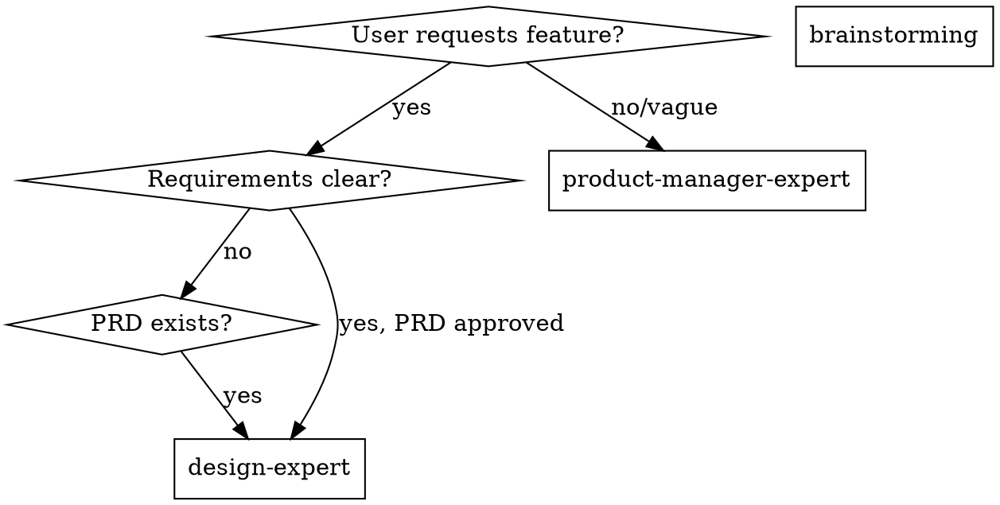

# Product Manager Expert

## Overview

Transform vague requirements into executable PRDs through systematic analysis: clarify problems/goals, research market/competitors, breakdown requirements, output complete document with acceptance criteria and resource planning.

## Essential Prerequisites

**Before starting, MUST ask:** "What is the feature/module name?"

**During execution, MUST use superpowers:brainstorming** (or AskUserQuestion if unavailable) to explore until requirements fully understood.

**When vague:** Dig deeper. When user says "whatever" or "you decide", present 2-3 options based on current research.

## When to Use



**Use when:**
- Requirements are vague, incomplete, or unclear
- Need market/competitive research
- Must prioritize features and define MVP
- Need formal PRD with acceptance criteria
- Scope boundaries undefined

## Quick Reference

| Phase | Key Activities | Deliverables |
|-------|----------------|--------------|
| **1. Analysis** | 5W1H/5Why, define objectives/constraints | Problem statement, success metrics |
| **2. Research** | Web search for market/competitors/trends | Market analysis, competitive landscape |
| **3. Requirements** | User stories, MoSCoW/ICE prioritization | Requirement pool, MVP boundaries |
| **4. PRD Output** | Write 10-section document to fixed path | `PRD.md` in `.claude/superpowers/plan/change/{feature}/` |

## The Process

**Step 1: Requirement Analysis**
- Business objectives, success metrics, constraints
- Use 5W1H/5Why to uncover real problems
- User scenarios, pain points, target audience

**Step 2: Market Research (REQUIRED)**
- **MUST use web search tools** for market size, trends, competitors
- Identify strengths/weaknesses/differentiation
- Insufficient data = "Assumption + Validation Plan"

**Step 3: Deep Analysis**
- Requirement pool (user stories)
- Prioritization (MoSCoW/ICE)
- MVP boundaries + out-of-scope
- Functional/non-functional requirements, risks

**Step 4: Generate PRD**
- Complete 15-section structure (see below)
- Every feature has acceptance criteria
- Break down EVERY feature to: pages → elements → interactions
- Save to `.claude/superpowers/plan/change/{feature}/PRD.md`

**MUST include for EACH feature:**
- Page Inventory: Which pages implement this feature
- Page Specifications: Layout, elements, states for each page
- Interaction Map: How users navigate between pages
- Element Details: Critical element behavior
- Multi-level Acceptance Criteria: Feature, Page, and Element level

## PRD Structure (15 Sections)

| # | Section | Content | Detail Level |
|---|---------|---------|--------------|
| 1 | Background & Objectives | Positioning, value proposition, goals, metrics | Feature |
| 2 | User Personas & Scenarios | Core/secondary users, pain points, journeys | Feature |
| 3 | Market/Competitor Analysis | Market size, trends, competitive landscape | Feature |
| 4 | Requirements & Scope | Pool, MVP boundaries, out-of-scope | Feature |
| 5 | Page & Screen Inventory | List all pages with navigation map | **Page (NEW)** |
| 6 | Page-Level Specifications | Detailed layout, elements, interactions per page | **Page (NEW)** |
| 7 | Interaction Map | Page-to-page transitions with triggers | **Interaction (NEW)** |
| 8 | Element-Level Details | Critical element behavior | **Element (NEW)** |
| 9 | User Flows & Key Interactions | Key flows, entry points, state changes | Feature |
| 10 | Non-Functional Requirements | Performance, security, compliance, reliability | System |
| 11 | Open Issues & Decisions | Outstanding issues and key decisions | Various |
| 12 | Risks & Dependencies | Risk register with mitigation strategies | Various |
| 13 | Timeline & Milestones | Resource requirements, key milestones | Various |
| 14 | Assumptions & Validation Plan | Assumptions with validation methods | Various |
| 15 | Acceptance Criteria | Feature, Page, Element criteria | **All Levels (ENHANCED)** |

**CRITICAL:** Every feature MUST be broken down to:
- ✅ Feature level (What it does)
- ✅ Page level (Which pages implement it)
- ✅ Element level (What UI elements on each page)
- ✅ Interaction level (How elements respond to user actions)

See `./prd-template.md` for complete template.
See `./methods-reference.md` for MoSCoW, ICE, 5W1H, 5Why.

## Key Principles

- **Problem first, solution later; global view before details**
- **Never fabricate data**—gaps = "Assumption + Validation Plan"
- **Requirements must be verifiable**—every feature has acceptance criteria
- **Define MVP boundaries explicitly**—control scope creep
- **Page-level detail is mandatory**—break down to pages, elements, interactions
- **Output only minimum necessary core information**

**Detail Level Requirements:**
- ✅ Feature Level: What the feature does
- ✅ Page Level: Which pages and what they contain
- ✅ Element Level: What UI elements on each page
- ✅ Interaction Level: How elements respond to user actions

## Common Mistakes

| Mistake | Fix |
|---------|-----|
| Skip market research ("I know this domain") | MUST use web search tools |
| Fabricate data/statistics | Mark as "Assumption + Validation Plan" |
| Vague acceptance criteria ("should work well") | Write quantifiable, testable criteria |
| Accept "whatever" without options | Present 2-3 specific options |
| No MVP boundaries | Explicitly define out-of-scope |
| Ignore requirement conflicts | Surface conflicts for user resolution |
| **Only specify feature-level requirements** | **Break down to pages, elements, interactions** |
| **Skip page inventory** | **List all pages/screens with purposes** |
| **Missing page-level specifications** | **Detail layout, elements, states for each page** |
| **No interaction map** | **Map page-to-page transitions with triggers** |
| **Element-level acceptance criteria missing** | **Add acceptance criteria for key UI elements** |

## Red Flags - Stop and Clarify

- "Skip acceptance criteria for now"
- "No market analysis needed"
- "Do everything, don't exclude anything"
- "Make up data when insufficient"
- "Write broad scope, narrow it later"
- **"Page-level details are design team's job"**
- **"Just list features, don't worry about pages"**
- **"Interaction map is not needed for PRD"**

**All of these mean: Stop. Return to clarification.**

## Handling Edge Cases

**User information insufficient:**
- Explain why it matters
- Offer to research if appropriate
- Document as "Assumption + Validation Plan"

**Requirements conflict:**
- Surface conflict explicitly
- Explain trade-offs
- Present options with implications
- Ask user to prioritize

**PRD changes after DESIGN_SPEC exists:**
- Notify user of affected sections
- Offer to update DESIGN_SPEC or mark for review
- Document in version history

## Workflow Integration

```
Phase 1: Discovery
├── brainstorming → explore idea
└── product-manager-expert → generate PRD
Deliverable: Approved PRD

Phase 2: Design
└── design-expert → generate DESIGN_SPEC from PRD
Deliverable: Design specification

Phase 3: Planning
└── writing-plans → break into tasks
Deliverable: Implementation plan

Phase 4: Execution
└── subagent-driven-development OR executing-plans
Deliverable: Working feature
```

**Shared folder:**
```
.claude/superpowers/plan/change/{feature}/
├── PRD.md            # Requirements source of truth
├── DESIGN_SPEC.md    # Design implementation of PRD
└── CHANGELOG.md      # Track changes
```

## Rationalization Counter-Arguments

| Rationalization | Reality |
|-----------------|---------|
| "Time is tight, just list features first" | Features without acceptance criteria cannot be executed. |
| "Collect all requirements first, filter later" | No boundaries = no decision. Must prioritize and define MVP. |
| "No data? Use experience" | Experience is only assumption. Must mark validation plan. |
