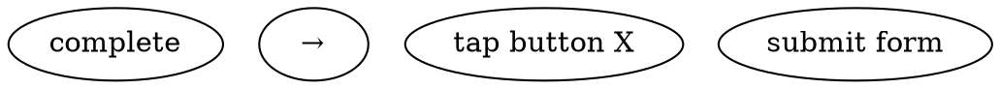

# PRD Markdown Template

Use this template when generating PRD documents.

Copy this structure and fill in all sections. Do not skip any sections.

**IMPORTANT:** This template is in English, but actual generated documents should be in **Chinese (Simplified)** per user requirements.

---

## Modern PRD Best Practices (2024-2025)

Based on industry standards from Product School, Amazon Working Backwards, and top tech companies:

- **Living Document**: PRDs evolve throughout the product lifecycle
- **Decision-Focused**: Note key decisions, add relevant links, leave no ambiguity
- **Collaborative**: Get input from design, engineering, and stakeholders early
- **Concise**: Prioritize clarity over completeness. TBD is acceptable for unknowns
- **Page-Level Detail**: Every feature MUST be broken down to pages, elements, and interactions

---

```markdown
# Product Requirements Document (PRD)

> **Feature/Module:** {feature name}
> **Path:** `.claude/superpowers/plan/change/{feature}/PRD.md` (use English for {feature})
> **UI Design Spec:** `.claude/superpowers/plan/change/{feature}/DESIGN_SPEC.md`
> **Status:** Draft | In Review | Approved | Deprecated
> **Owner:** {Product Manager}

---

## Change History

Record all significant changes. Start with v0.1.

| Version | Date | Changes | Owner |
|---------|------|---------|-------|
| v0.1 | YYYY-MM-DD | Initial draft | {Name} |
| v0.2 | YYYY-MM-DD | Added [section]; clarified [X] | {Name} |

---

## 1. Overview

### 1.1 Background
- Current situation/problem:
- Why now? (Change drivers: market/user/technology/business):
- Related initiatives/dependencies:

### 1.2 Objectives
- Business objectives (what we want to achieve):
- Success metrics (SMART - Specific, Measurable, Achievable, Relevant, Time-bound):

| Metric | Current | Target | Timeframe | How to Measure |
|--------|---------|--------|-----------|----------------|
| {Metric name} | {Baseline} | {Goal} | {Date} | {Data source} |

### 1.3 Product Positioning
- One-line value proposition:
- Target users (core/secondary):
- Key differentiators vs alternatives:

---

## 2. User & Market Analysis

### 2.1 User Personas

**Core Persona:**
- Name/Role:
- Goals:
- Pain points:
- Current solutions:
- Key quote: "> [Direct quote representing their mindset]"

**Secondary Persona:**
- Name/Role:
- Needs (brief):

### 2.2 User Scenarios
- Scenario 1: [Primary use case, step-by-step]
- Scenario 2: [Secondary use case]
- Scenario 3: [Edge case or exception flow]

### 2.3 Market Analysis
- Market size/trends (cite sources or mark as **Assumption**):
- Competitive landscape:

| Competitor | Strengths | Weaknesses | Our Differentiation |
|-----------|-----------|------------|---------------------|
| Competitor A |  |  |  |

---

## 3. Requirements & Scope

### 3.1 Requirements Pool (MoSCoW Prioritized)

| Priority | Feature | User Value | Business Value | Acceptance Criteria |
|----------|---------|------------|----------------|---------------------|
| **Must Have (P0)** | | | | |
| | {Feature name} | {Why user cares} | {Why business cares} | {Given/When/Then} |
| **Should Have (P1)** | | | | |
| | {Feature name} | | | |
| **Could Have (P2)** | | | | |
| | {Feature name} | | | |

### 3.2 MVP Boundaries

**IN Scope (P0 for launch):**
- {Core feature 1}
- {Core feature 2}

**OUT of Scope (Explicitly NOT doing):**
- {Feature X} → Reason: {Why not now}
- {Feature Y} → Reason: {Consider for P1/P2}

---

## 4. Page & Screen Inventory

> **CRITICAL:** This section breaks down features into concrete pages/screens with elements

### 4.1 Page List

| Page ID | Page Name | Purpose | Primary Users | Priority |
|---------|-----------|---------|---------------|----------|
| P001 | {Page name} | {What this page does} | {Who uses it} | P0/P1/P2 |
| P002 | {Page name} | {What this page does} | {Who uses it} | P0/P1/P2 |
| P003 | {Page name} | {What this page does} | {Who uses it} | P0/P1/P2 |

### 4.2 Navigation Map



**Key Navigation Paths:**
- Main flow: {Page A} → {Page B} → {Page C}
- Secondary flow: {Page X} → {Page Y}
- Exception flow: {Page A} → {Error Page}

---

## 5. Page-Level Specifications

> **CRITICAL:** Each page MUST have detailed specification with layout, elements, and interactions

### 5.1 P001: {Page Name}

**Purpose:**
{What this page achieves for the user}

**Layout (ASCII or description):**
```
+----------------------------------+
|           Header                 |
|  [Logo]    [Title]    [Menu]    |
+----------------------------------+
|                                  |
|     [Primary Content Area]       |
|                                  |
|  [Element 1]  [Element 2]         |
|                                  |
+----------------------------------+
|           Footer                 |
|    [Button A]    [Button B]       |
+----------------------------------+
```

**Page Elements:**

| Element ID | Element Type | Description | Behavior |
|------------|--------------|-------------|----------|
| E001-P001 | Button | {Button label/purpose} | {What happens when tapped} |
| E002-P001 | Input Field | {Input field label} | {Validation rules} |
| E003-P001 | Card/Tile | {Card content} | {Tap behavior} |
| E004-P001 | Text Label | {Label text} | {Conditional display} |

**Interactions:**
- **Primary Action:** {Element} → {Result}
- **Secondary Action:** {Element} → {Result}
- **Swipe/Gesture:** {Gesture} → {Result}
- **Voice/Audio:** {Voice command} → {Result}

**State Variations:**
- **Empty State:** {What shows when no data}
- **Loading State:** {What shows during loading}
- **Error State:** {What shows on error}
- **Success State:** {What shows on success}

**Page-Level Acceptance Criteria:**
- Given: {Precondition}
- When: {User action}
- Then: {Expected outcome on this page}
- And: {Specific element behavior}

### 5.2 P002: {Page Name}

[Repeat structure for each page]

---

## 6. Interaction Map

> **CRITICAL:** Maps all user interactions to page transitions

### 6.1 Interaction Matrix

| From Page | Action | Trigger | To Page | Data Passed |
|-----------|--------|---------|---------|-------------|
| Home Page | Tap "Get Started" | Button onTap | Onboarding Page | - |
| Onboarding Page | Complete all steps | Auto | Home Page | User profile |
| Home Page | Tap notification | Notification onTap | Notification Detail | Notification ID |
| {Page} | {Action} | {Trigger} | {Target Page} | {Data} |

### 6.2 Key User Flows (Page-Level)

**Flow 1: {Primary Flow Name}**
```
{Page A} → [Action] → {Page B} → [Action] → {Page C} → [Action] → {Complete}
```

**Flow 2: {Secondary Flow Name}**
```
{Page X} → [Action] → {Page Y} → [Action] → Error → [Recovery] → {Page X}
```

---

## 7. Element-Level Details (For Critical Elements)

> **For complex or critical UI elements, specify exact behavior**

### 7.1 E001-P001: {Element Name}

**Element Type:** Button/Input/Card/Modal/etc.

**Visual Specifications:**
- Size: {Dimensions}
- Position: {Location on page}
- Style: {Colors, fonts, icons}
- States: Default/Hover/Active/Disabled/Error

**Behavior:**
- **Idle:** {What it does when not interacting}
- **On Tap/Click:** {Immediate response}
- **On Hold/Long Press:** {Extended interaction}
- **On Swipe:** {Gesture response}
- **Error Handling:** {What happens on invalid input}

**Validation Rules:**
- Input format: {Required format}
- Required vs Optional: {Is it mandatory}
- Error messages: {Specific error text}

---

## 8. User Flows & Key Interactions (Legacy - Keep for Reference)

### 8.1 Main Flow
- Entry point: [Where users start]
- Steps: [1 → 2 → 3 → ...]
- End state: [Success outcome]

### 8.2 Exception Flows
- [Edge case 1 and handling]
- [Error state 1 and recovery]

### 8.3 State Changes
- [Key state transitions and triggers]

---

## 9. Non-Functional Requirements

| Category | Requirement | Metric/Standard |
|----------|-------------|-----------------|
| **Performance** | Response time (P95) | < X seconds |
| | Concurrent users | X+ |
| **Security** | Authentication | {Standard} |
| | Data encryption | {Standard} |
| **Compliance** | GDPR/CCPA/etc. | {Requirements} |
| **Reliability** | Uptime target | X% |
| **Usability** | Accessibility | WCAG X.X |

---

## 10. Acceptance Criteria

### 10.1 Feature-Level Acceptance Criteria

| Feature | Given | When | Then | Priority |
|---------|-------|------|------|----------|
| {Feature name} | {Precondition} | {User action} | {Expected outcome} | P0/P1/P2 |

### 10.2 Page-Level Acceptance Criteria

| Page ID | Page Name | Given | When | Then | Priority |
|---------|-----------|-------|------|------|----------|
| P001 | {Page name} | {Precondition} | {User enters page} | {Expected page state} | P0 |
| P001 | {Page name} | {On page} | {Taps element X} | {Expected behavior} | P0 |

### 10.3 Element-Level Acceptance Criteria

| Element ID | Element Name | Given | When | Then | Priority |
|------------|--------------|-------|------|------|----------|
| E001-P001 | {Element} | {Precondition} | {User interacts} | {Expected response} | P0 |

---

## 11. Open Issues & Decisions

### 11.1 Open Issues (To Resolve)
- [ ] {Issue 1} → Owner: {Name}, Due: {Date}
- [ ] {Issue 2} → Owner: {Name}, Due: {Date}

### 11.2 Key Decisions Made
- **Decision:** {What was decided}
- **Rationale:** {Why}
- **Alternatives considered:** {What else was explored}

---

## 12. Risks & Dependencies

### 12.1 Risk Register

| Risk | Impact | Probability | Severity | Mitigation | Owner |
|------|--------|-------------|----------|------------|-------|
| {Risk description} | High/Med/Low | High/Med/Low | Critical/High/Med/Low | {How to prevent} | {Name} |

**Severity = Impact × Probability**

### 12.2 Dependencies
- **System:** {System/API we depend on}
- **Data:** {Data we need}
- **Team:** {Cross-team coordination}
- **External:** {Third-party services}

---

## 13. Timeline & Milestones

| Phase | Deliverable | Target Date | Dependencies |
|-------|-------------|-------------|--------------|
| Phase 1 | {MVP features} | YYYY-MM-DD | {Dependency} |
| Phase 2 | {P1 features} | YYYY-MM-DD | {Dependency} |

### Key Milestones (Acceptance Points)
- **M1 ({Date}):** {What must be done, acceptance criteria}
- **M2 ({Date}):** {What must be done, acceptance criteria}

---

## 14. Assumptions & Validation Plan

| Assumption | Validation Method | Owner | Due Date |
|------------|-------------------|-------|----------|
| {Assumption 1} | {How to validate} | {Name} | {Date} |

*If assumption proves false: {Fallback plan}*

---

## 15. Q&A (Common Questions)

Document questions raised during reviews and their answers:

**Q: {Question}**
A: {Answer with rationale}

**Q: {Question}**
A: {Answer with rationale}

---

## Appendix: Reference Materials

- **Designs:** [Link to Figma/Design files]
- **Technical Specs:** [Link to technical documentation]
- **Research Data:** [Link to user research/market analysis]
- **Related PRDs:** [Link to dependent PRDs]
```

---

## Template Usage Guidelines

1. **Feature naming:** Use English for directory names (e.g., `user-authentication`, `dashboard-feature`)
2. **Language:** Template structure is in English, but fill content in **Chinese (Simplified)**
3. **Completeness:** Fill all sections. Use TBD for unknowns, not blanks
4. **Updates:** Keep Change History current with every revision
5. **Co-location:** PRD and DESIGN_SPEC must live in same feature folder

---

## Key Principles

- **Problem first, solution later:** Start with user problem, not feature list
- **Never fabricate data:** Use "Assumption + Validation Plan" for gaps
- **Define MVP explicitly:** Clear boundaries prevent scope creep
- **Page-level detail:** Every feature MUST break down to pages, elements, interactions
- **Make decisions visible:** Document rationale in Q&A or Key Decisions
- **Keep it living:** Update as you learn; don't treat as static

---

## Section Reference Summary

| Section | Purpose | Detail Level | Required |
|---------|---------|--------------|----------|
| 1. Overview | Product context | Feature-level | ✅ Yes |
| 2. User & Market | User and competitive | Feature-level | ✅ Yes |
| 3. Requirements | Feature pool with MoSCoW | Feature-level | ✅ Yes |
| 4. Page Inventory | List all pages/screens | Page-level | ✅ **Yes (NEW)** |
| 5. Page Specs | Detailed page specifications | Page-level | ✅ **Yes (NEW)** |
| 6. Interaction Map | Page-to-page navigation | Interaction-level | ✅ **Yes (NEW)** |
| 7. Element Details | Critical element behavior | Element-level | ⚠️ As needed |
| 8. User Flows | Legacy flow documentation | Feature-level | ⚠️ Reference |
| 9. Non-Functional | Performance, security, etc. | System-level | ✅ Yes |
| 10. Acceptance | Feature, Page, Element criteria | All levels | ✅ **Enhanced** |
| 11-15. | Supporting sections | Various | ✅ Yes |

---

## Industry References

This template incorporates best practices from:

- **[Product School PRD Template](https://productschool.com/blog/product-strategy/product-template-requirements-document-prd)** - Modern PRD structure with Change History, Open Issues, Q&A
- **[Amazon Working Backwards](https://www.hustlebadger.com/what-do-product-managers-do/amazon-working-backwards-process/)** - Customer-obsessed, press-release-first thinking
- **[Docs Culture at Big Tech](https://twocentspm.substack.com/p/docs-culture-at-amazon-google-and)** - Living documents, collaborative wikis, structured thinking

Sources:
- [Product School: The Only PRD Template You Need (2025)](https://productschool.com/blog/product-strategy/product-template-requirements-document-prd)
- [Hustle Badger: Amazon Working Backwards Template](https://www.hustlebadger.com/what-do-product-managers-do/amazon-working-backwards-process/)
- [Two Cents PM: Docs Culture at Amazon, Google, Anthropic](https://twocentspm.substack.com/p/docs-culture-at-amazon-google-and)
- [Product Management World: Complete PRD Template Guide](https://www.prodmgmt.world/blog/prd-template-guide)
